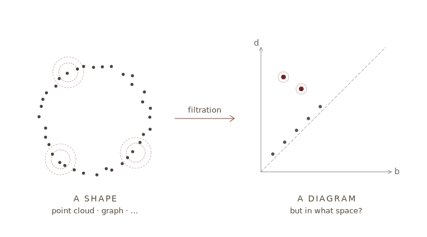
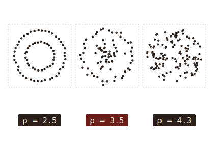
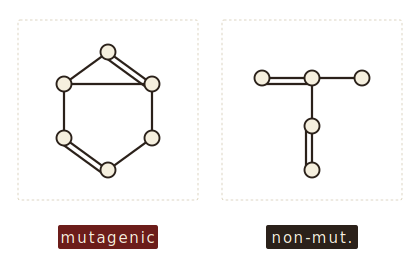
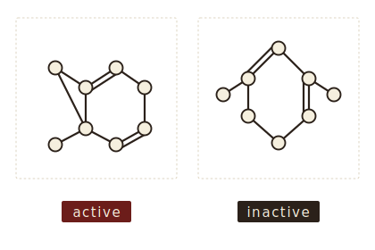
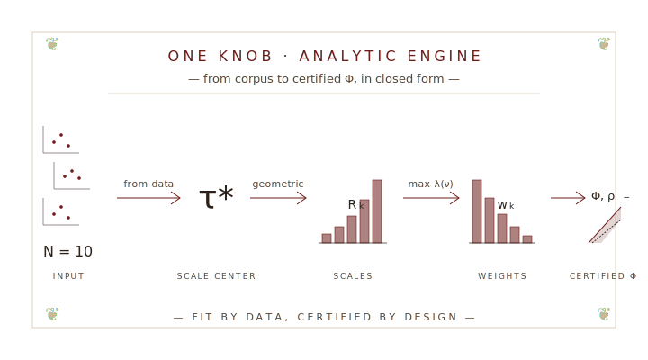
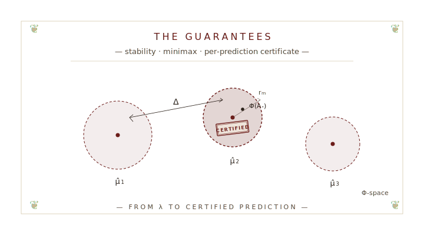
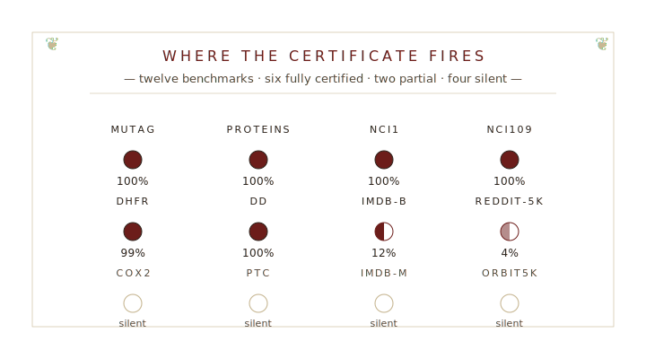

# The Plan of the Talk {.section-divider}

::: {.front-index data-title="Inside today's edition"}
| §    | Article                                                                    |
|:----:|:---------------------------------------------------------------------------|
|  I.  | [**Motivation**]{style="color: var(--oxblood);"}: stability · discriminability; the *band* that closes the gap. |
|  II. | [**Construction**]{style="color: var(--oxblood);"}: one knob $N$; an analytic engine; a certified $\Phi$.        |
| III. | [**Theory**]{style="color: var(--oxblood);"}: $\lambda \to \Delta$; tight margin & minimax; the NC certificate. |
|  IV. | [**Experiments**]{style="color: var(--oxblood);"}: twelve benchmarks; where the certificate fires; silent ≠ wrong. |
|   V. | [**The wider arc**]{style="color: var(--oxblood);"}: `PALACE`, `CASTLE`, open questions.                            |

:::

::: {.composing-rule .crosses}
:::

# § I.  Motivation {.section-divider}

::: {.section-deck}
*From point clouds to certified classifiers, via topology.*
:::

::: {.plate}

:::

::: {.plate-caption}
An honest feature map lives **in the band**.
:::

## The task

::: {.standfirst}
Given a labeled corpus of [point clouds]{.term-with-icon data-icon="pointcloud"} or [graphs]{.term-with-icon data-icon="graph"}, learn a rule that predicts the label of a new instance.
:::

```{=html}
<svg width="0" height="0" style="position:absolute" aria-hidden="true">
  <defs>
    <symbol id="icon-pointcloud" viewBox="0 0 28 28">
      <g fill="currentColor" stroke="none">
        <circle cx="6"  cy="9"  r="1.6"/>
        <circle cx="11" cy="6"  r="1.6"/>
        <circle cx="16" cy="8"  r="1.6"/>
        <circle cx="9"  cy="13" r="1.6"/>
        <circle cx="14" cy="14" r="1.6"/>
        <circle cx="20" cy="11" r="1.6"/>
        <circle cx="11" cy="19" r="1.6"/>
        <circle cx="17" cy="20" r="1.6"/>
        <circle cx="22" cy="17" r="1.6"/>
      </g>
    </symbol>
    <symbol id="icon-graph" viewBox="0 0 28 28">
      <g stroke="currentColor" fill="currentColor" stroke-width="1.0">
        <line x1="6"  y1="7"  x2="14" y2="11" fill="none"/>
        <line x1="14" y1="11" x2="22" y2="8"  fill="none"/>
        <line x1="14" y1="11" x2="9"  y2="20" fill="none"/>
        <line x1="14" y1="11" x2="20" y2="21" fill="none"/>
        <line x1="9"  y1="20" x2="20" y2="21" fill="none"/>
        <line x1="22" y1="8"  x2="20" y2="21" fill="none"/>
        <circle cx="6"  cy="7"  r="2.4"/>
        <circle cx="14" cy="11" r="2.4"/>
        <circle cx="22" cy="8"  r="2.4"/>
        <circle cx="9"  cy="20" r="2.4"/>
        <circle cx="20" cy="21" r="2.4"/>
      </g>
    </symbol>
  </defs>
</svg>
```

::: {.dataset-cards}
::: {.dataset-card .fragment data-fragment-index="1"}


**ORBIT5K**

`‹5 000›` synthetic point clouds; five orbit-dynamics classes. *Canonical TDA point-cloud benchmark.*
:::

::: {.dataset-card .fragment data-fragment-index="2"}


**MUTAG**

`‹188›` molecular graphs; *mutagenic* vs. *non-mutagenic*. *Small, binary, clean.*
:::

::: {.dataset-card .fragment data-fragment-index="3"}


**NCI1**

`‹4 110›` chemical compounds; active vs. inactive in a cancer-cell-line screen. *Medium; node-label-dominated.*
:::
:::

::: {.composing-rule .fragment data-fragment-index="4"}
:::

::: {.transition-line .fragment .fade-up data-fragment-index="4"}
Every classical recipe begins the same way: turn each instance into a vector. The art is in *how*.
:::

## What does a good feature map need?

::: {.plate}

```{=html}
<svg xmlns="http://www.w3.org/2000/svg" viewBox="0 0 720 95">
<g>
<!-- horizontal dashed separator (aligned with stage arrows at y=48) -->
<line x1="64" y1="48" x2="126" y2="48" stroke="#c8b894" stroke-width="0.8" stroke-dasharray="2.5 2.5" opacity="0.75"/>
<!-- TL: point cloud class A (oxblood) -->
<g fill="#6c1d1a" stroke="none">
<circle cx="67" cy="30" r="2.2"/><circle cx="74" cy="25" r="2.2"/><circle cx="82" cy="29" r="2.2"/>
<circle cx="88" cy="35" r="2.2"/><circle cx="81" cy="40" r="2.2"/><circle cx="71" cy="40" r="2.2"/>
<circle cx="65" cy="36" r="2.2"/><circle cx="77" cy="33" r="2.2"/>
</g>
<!-- TR: point cloud class B (ink) -->
<g fill="#2b211a" stroke="none">
<circle cx="102" cy="30" r="2.2"/><circle cx="109" cy="25" r="2.2"/><circle cx="117" cy="29" r="2.2"/>
<circle cx="123" cy="35" r="2.2"/><circle cx="116" cy="40" r="2.2"/><circle cx="106" cy="40" r="2.2"/>
<circle cx="100" cy="36" r="2.2"/><circle cx="112" cy="33" r="2.2"/>
</g>
<!-- BL: graph class A (oxblood) -->
<g stroke="#6c1d1a" stroke-width="1.1" stroke-linecap="round" fill="none">
<line x1="67" y1="58" x2="83" y2="54"/>
<line x1="83" y1="54" x2="89" y2="67"/>
<line x1="67" y1="58" x2="75" y2="72"/>
<line x1="75" y1="72" x2="89" y2="67"/>
<line x1="83" y1="54" x2="75" y2="72"/>
</g>
<g fill="#f5efde" stroke="#6c1d1a" stroke-width="1.1">
<circle cx="67" cy="58" r="3.0"/><circle cx="83" cy="54" r="3.0"/>
<circle cx="89" cy="67" r="3.0"/><circle cx="75" cy="72" r="3.0"/>
</g>
<!-- BR: graph class B (ink) -->
<g stroke="#2b211a" stroke-width="1.1" stroke-linecap="round" fill="none">
<line x1="103" y1="58" x2="119" y2="54"/>
<line x1="119" y1="54" x2="125" y2="67"/>
<line x1="103" y1="58" x2="111" y2="72"/>
<line x1="111" y1="72" x2="125" y2="67"/>
<line x1="119" y1="54" x2="111" y2="72"/>
</g>
<g fill="#f5efde" stroke="#2b211a" stroke-width="1.1">
<circle cx="103" cy="58" r="3.0"/><circle cx="119" cy="54" r="3.0"/>
<circle cx="125" cy="67" r="3.0"/><circle cx="111" cy="72" r="3.0"/>
</g>
<text x="95" y="88" fill="#57473a" font-family="Alegreya SC, EB Garamond, Georgia, serif" font-size="10" letter-spacing="1.3" text-anchor="middle">LABELED SHAPES</text>
</g>
<g class="fragment" data-fragment-index="2">
<g stroke="#6c1d1a" fill="none" stroke-width="0.9">
<line x1="145" y1="48" x2="205" y2="48"/>
<path d="M 197 43 L 205 48 L 197 53"/>
</g>
<rect x="238" y="26" width="44" height="44" rx="2" fill="none" stroke="#2b211a" stroke-width="1.2"/>
<text x="260" y="56" fill="#2b211a" font-family="EB Garamond, Georgia, serif" font-size="24" text-anchor="middle">Φ</text>
<text x="260" y="88" fill="#57473a" font-family="Alegreya SC, EB Garamond, Georgia, serif" font-size="10" letter-spacing="1.3" text-anchor="middle">FEATURE MAP</text>
</g>
<g class="fragment" data-fragment-index="3">
<g stroke="#6c1d1a" fill="none" stroke-width="0.9">
<line x1="315" y1="48" x2="375" y2="48"/>
<path d="M 367 43 L 375 48 L 367 53"/>
</g>
<g stroke="#2b211a" fill="none" stroke-width="1.0">
<path d="M 435 28 L 428 28 L 428 68 L 435 68"/>
<path d="M 465 28 L 472 28 L 472 68 L 465 68"/>
</g>
<g fill="#2b211a" stroke="none" font-family="EB Garamond, Georgia, serif" font-size="11" text-anchor="middle">
<text x="450" y="42">v₁</text>
<text x="450" y="52">v₂</text>
<text x="450" y="62">⋮</text>
</g>
<text x="450" y="88" fill="#57473a" font-family="EB Garamond, Georgia, serif" font-style="italic" font-size="12" text-anchor="middle">ℝ<tspan baseline-shift="super" font-size="0.7em" dx="1">ℓ</tspan></text>
</g>
<g class="fragment" data-fragment-index="4">
<g stroke="#6c1d1a" fill="none" stroke-width="0.9">
<line x1="495" y1="48" x2="555" y2="48"/>
<path d="M 547 43 L 555 48 L 547 53"/>
</g>
<polygon points="587,24 643,24 643,34 587,62" fill="#6c1d1a" fill-opacity="0.10" stroke="none"/>
<polygon points="587,62 643,34 643,72 587,72" fill="#2b211a" fill-opacity="0.07" stroke="none"/>
<rect x="587" y="24" width="56" height="48" fill="none" stroke="#c8b894" stroke-width="0.6" stroke-dasharray="2 2"/>
<line x1="587" y1="62" x2="643" y2="34" stroke="#2b211a" stroke-width="1.0" stroke-dasharray="3 2"/>
<g fill="#6c1d1a" stroke="none">
<circle cx="598" cy="35" r="1.9"/>
<circle cx="604" cy="42" r="1.9"/>
<circle cx="609" cy="34" r="1.9"/>
<circle cx="602" cy="46" r="1.9"/>
<circle cx="608" cy="48" r="1.9"/>
</g>
<g fill="#2b211a" stroke="none">
<circle cx="619" cy="52" r="1.9"/>
<circle cx="626" cy="50" r="1.9"/>
<circle cx="632" cy="57" r="1.9"/>
<circle cx="622" cy="59" r="1.9"/>
<circle cx="629" cy="61" r="1.9"/>
</g>
<text x="615" y="80" fill="#57473a" font-family="Alegreya SC, EB Garamond, Georgia, serif" font-size="8" letter-spacing="0.6" text-anchor="middle">CLASSIFIER IN</text>
<text x="615" y="89" fill="#57473a" font-family="Alegreya SC, EB Garamond, Georgia, serif" font-size="8" letter-spacing="0.6" text-anchor="middle">HILBERT SPACE</text>
</g>
</svg>
```

:::

::: {.dispatches .fragment data-fragment-index="5" data-title="Notice to applicants" style="font-size: 0.78em; padding: 0.7rem 1.3rem 0.55rem; margin: 1.5rem auto 0.4rem;"}
::: {style="font-size: 0.95em; margin-bottom: 0.45em; line-height: 1.35;"}
For a [point cloud]{.term-with-icon data-icon="pointcloud"} or a [graph]{.term-with-icon data-icon="graph"}, four properties decide whether $\Phi$ is a feature map worth the name:
:::

- **Invariance.** $\Phi(X) = \Phi(g \cdot X)$ for every symmetry $g$ (vertex relabeling; rotation / translation).
- **Stability.** $\|\Phi(X) - \Phi(X')\| \leq \rho^+ \, d(X, X')$ — close inputs ⇒ close outputs.
- **Discriminability.** $\|\Phi(X) - \Phi(X')\| \geq \rho^- \, d(X, X')$ — distant inputs ⇒ distant outputs.
- **Sample-efficient.** Informative when training labels are scarce.
:::

::: {.transition-line .fragment .fade-up}
Topology meets all four. The **bill** comes *later*. [To follow →]{.followup-stamp .tilt-c}
:::

## Topology as the descriptor

::: {.standfirst style="font-style: normal;"}
**Persistence diagrams**: the multi-scale shape summary — *isometry-invariant*, *GH-Lipschitz*, *dimension-aware*.
:::

::: {.plate .fragment data-fragment-index="1"}

```{=html}
<svg xmlns="http://www.w3.org/2000/svg" viewBox="0 0 720 95">

<!-- PANEL A: Point cloud (annulus, center 102, r=14) -->
<g>
<g fill="#6c1d1a" stroke="none">
<circle cx="116" cy="48" r="2.2"/>
<circle cx="113" cy="56" r="2.2"/>
<circle cx="106" cy="61" r="2.2"/>
<circle cx="98" cy="61" r="2.2"/>
<circle cx="91" cy="56" r="2.2"/>
<circle cx="88" cy="48" r="2.2"/>
<circle cx="91" cy="40" r="2.2"/>
<circle cx="98" cy="35" r="2.2"/>
<circle cx="106" cy="35" r="2.2"/>
<circle cx="113" cy="40" r="2.2"/>
</g>
<text x="102" y="88" fill="#57473a" font-family="Alegreya SC, EB Garamond, Georgia, serif" font-size="10" letter-spacing="1.3" text-anchor="middle">POINT CLOUD</text>
</g>

<!-- STAGE 2: arrow + VR filtration (annulus, center 244, r=14) -->
<g class="fragment" data-fragment-index="2">
<g stroke="#6c1d1a" fill="none" stroke-width="0.9">
<line x1="138" y1="48" x2="198" y2="48"/>
<path d="M 190 43 L 198 48 L 190 53"/>
</g>
<g fill="#6c1d1a" fill-opacity="0.13" stroke="none">
<circle cx="258" cy="48" r="5"/>
<circle cx="255" cy="56" r="5"/>
<circle cx="248" cy="61" r="5"/>
<circle cx="240" cy="61" r="5"/>
<circle cx="233" cy="56" r="5"/>
<circle cx="230" cy="48" r="5"/>
<circle cx="233" cy="40" r="5"/>
<circle cx="240" cy="35" r="5"/>
<circle cx="248" cy="35" r="5"/>
<circle cx="255" cy="40" r="5"/>
</g>
<g stroke="#6c1d1a" stroke-width="0.7" fill="none">
<line x1="258" y1="48" x2="255" y2="56"/>
<line x1="255" y1="56" x2="248" y2="61"/>
<line x1="248" y1="61" x2="240" y2="61"/>
<line x1="240" y1="61" x2="233" y2="56"/>
<line x1="233" y1="56" x2="230" y2="48"/>
<line x1="230" y1="48" x2="233" y2="40"/>
<line x1="233" y1="40" x2="240" y2="35"/>
<line x1="240" y1="35" x2="248" y2="35"/>
<line x1="248" y1="35" x2="255" y2="40"/>
<line x1="255" y1="40" x2="258" y2="48"/>
</g>
<g fill="#6c1d1a" stroke="none">
<circle cx="258" cy="48" r="2.2"/>
<circle cx="255" cy="56" r="2.2"/>
<circle cx="248" cy="61" r="2.2"/>
<circle cx="240" cy="61" r="2.2"/>
<circle cx="233" cy="56" r="2.2"/>
<circle cx="230" cy="48" r="2.2"/>
<circle cx="233" cy="40" r="2.2"/>
<circle cx="240" cy="35" r="2.2"/>
<circle cx="248" cy="35" r="2.2"/>
<circle cx="255" cy="40" r="2.2"/>
</g>
<text x="244" y="88" fill="#57473a" font-family="Alegreya SC, EB Garamond, Georgia, serif" font-size="10" letter-spacing="1.3" text-anchor="middle">FILTRATION</text>
</g>

<!-- STAGE 3: arrow + barcode -->
<g class="fragment" data-fragment-index="3">
<g stroke="#6c1d1a" fill="none" stroke-width="0.9">
<line x1="290" y1="48" x2="350" y2="48"/>
<path d="M 342 43 L 350 48 L 342 53"/>
</g>
<g stroke-linecap="round">
<line x1="356" y1="30" x2="456" y2="30" stroke="#2b211a" stroke-width="1.8"/>
<line x1="356" y1="38" x2="366" y2="38" stroke="#2b211a" stroke-width="1.5"/>
<line x1="356" y1="44" x2="371" y2="44" stroke="#2b211a" stroke-width="1.5"/>
<line x1="356" y1="50" x2="364" y2="50" stroke="#2b211a" stroke-width="1.5"/>
<line x1="356" y1="56" x2="369" y2="56" stroke="#2b211a" stroke-width="1.5"/>
<line x1="380" y1="64" x2="440" y2="64" stroke="#6c1d1a" stroke-width="2.2"/>
</g>
<text x="406" y="88" fill="#57473a" font-family="Alegreya SC, EB Garamond, Georgia, serif" font-size="10" letter-spacing="1.3" text-anchor="middle">BARCODE</text>
</g>

<!-- STAGE 4: arrow + persistence diagram -->
<g class="fragment" data-fragment-index="4">
<g stroke="#6c1d1a" fill="none" stroke-width="0.9">
<line x1="462" y1="48" x2="522" y2="48"/>
<path d="M 514 43 L 522 48 L 514 53"/>
</g>
<g stroke="#2b211a" fill="none" stroke-width="0.8">
<line x1="540" y1="68" x2="640" y2="68"/>
<line x1="540" y1="68" x2="540" y2="26"/>
</g>
<line x1="540" y1="68" x2="582" y2="26" stroke="#57473a" stroke-width="0.6" stroke-dasharray="2 2" fill="none"/>
<g fill="#2b211a" stroke="none">
<circle cx="541" cy="66" r="1.6"/>
<circle cx="541" cy="65" r="1.6"/>
<circle cx="542" cy="64" r="1.6"/>
<circle cx="543" cy="63" r="1.6"/>
</g>
<circle cx="540" cy="28" r="1.8" fill="#2b211a" stroke="none"/>
<text x="546" y="31" fill="#2b211a" font-family="EB Garamond, Georgia, serif" font-style="italic" font-size="8">∞</text>
<circle cx="548" cy="40" r="2.4" fill="#6c1d1a" stroke="none"/>
<text x="644" y="71" fill="#2b211a" font-family="EB Garamond, Georgia, serif" font-style="italic" font-size="9">b</text>
<text x="537" y="24" fill="#2b211a" font-family="EB Garamond, Georgia, serif" font-style="italic" font-size="9">d</text>
<text x="588" y="88" fill="#57473a" font-family="Alegreya SC, EB Garamond, Georgia, serif" font-size="10" letter-spacing="1.3" text-anchor="middle">DIAGRAM</text>
</g>

</svg>
```

:::

::: {.dispatches .fragment data-fragment-index="5" data-title="The catch" style="font-size: 0.82em; padding: 0.75rem 1.3rem 0.6rem; margin: 1.6rem auto 0.5rem;"}
- **The space.** $(\mathcal{D}, d_\mathcal{B})$ isn't Hilbertian — and ML wants vectors.
- **The question.** What map $\Phi \colon (\mathcal{D}, d_\mathcal{B}) \to \mathbb{R}^\ell$ is *good enough* for classification?
:::

::: {.transition-line .fragment .fade-up}
PDs answer the call — but they live in the wrong space. [[☞]{.manicule}Embed]{.followup-stamp .tilt-b}
:::

## Existing embeddings — and what they miss

::: {.standfirst style="font-style: normal; font-size: 0.95em; margin: -0.5rem 0 0;"}
Embeddings of $(\mathcal{D}, d_\mathcal{B})$ abound — all bound distortion *from one side only*.
:::

::: {.dataset-cards style="margin: -0.8rem auto 0.9rem; gap: 1.4rem;"}

::: {.dataset-card .fragment data-fragment-index="1" style="padding: 0.25rem 0.3rem 0.35rem;"}

```{=html}
<svg xmlns="http://www.w3.org/2000/svg" viewBox="0 0 100 70" style="height: 48px; width: auto; max-height: 48px;">
<line x1="8" y1="55" x2="92" y2="55" stroke="#2b211a" stroke-width="0.6"/>
<path d="M 10 55 C 25 55, 38 16, 50 16 C 62 16, 75 55, 90 55" fill="#6c1d1a" fill-opacity="0.15" stroke="#6c1d1a" stroke-width="1.4" stroke-linejoin="round"/>
<circle cx="50" cy="16" r="1.8" fill="#6c1d1a"/>
</svg>
```

**KERNELS**

*sliced-Wasserstein · persistence-Fisher · WKPI*

Implicit RKHS map; Lipschitz in $d_\mathcal{B}$; *no closed-form margin*.

[after Reininghaus '15 · Kusano '16 · Carrière '17 · Le-Yamada '18 · Zhao-Wang '19]{.card-cite}

:::

::: {.dataset-card .fragment data-fragment-index="2" style="padding: 0.25rem 0.3rem 0.35rem;"}

```{=html}
<svg xmlns="http://www.w3.org/2000/svg" viewBox="0 0 100 70" style="height: 48px; width: auto; max-height: 48px;">
<g stroke="#2b211a" stroke-width="0.5" fill="#6c1d1a">
<rect x="22" y="14" width="12" height="12" fill-opacity="0.18"/>
<rect x="36" y="14" width="12" height="12" fill-opacity="0.45"/>
<rect x="50" y="14" width="12" height="12" fill-opacity="0.78"/>
<rect x="64" y="14" width="12" height="12" fill-opacity="0.30"/>
<rect x="22" y="28" width="12" height="12" fill-opacity="0.60"/>
<rect x="36" y="28" width="12" height="12" fill-opacity="0.95"/>
<rect x="50" y="28" width="12" height="12" fill-opacity="0.55"/>
<rect x="64" y="28" width="12" height="12" fill-opacity="0.18"/>
<rect x="22" y="42" width="12" height="12" fill-opacity="0.25"/>
<rect x="36" y="42" width="12" height="12" fill-opacity="0.50"/>
<rect x="50" y="42" width="12" height="12" fill-opacity="0.30"/>
<rect x="64" y="42" width="12" height="12" fill-opacity="0.10"/>
</g>
</svg>
```

**VECTORISATIONS**

*persistence images · landscapes*

Explicit map; Lipschitz; *hyper-parameters tuned on held-out data*.

[after Bubenik '15 · Adams '17]{.card-cite}

:::

::: {.dataset-card .fragment data-fragment-index="3" style="padding: 0.25rem 0.3rem 0.35rem;"}

```{=html}
<svg xmlns="http://www.w3.org/2000/svg" viewBox="0 0 100 70" style="height: 48px; width: auto; max-height: 48px;">
<g stroke="#2b211a" stroke-width="0.5" stroke-opacity="0.55" fill="none">
<line x1="22" y1="14" x2="50" y2="25"/>
<line x1="22" y1="14" x2="50" y2="45"/>
<line x1="22" y1="35" x2="50" y2="25"/>
<line x1="22" y1="35" x2="50" y2="45"/>
<line x1="22" y1="56" x2="50" y2="25"/>
<line x1="22" y1="56" x2="50" y2="45"/>
<line x1="50" y1="25" x2="78" y2="35"/>
<line x1="50" y1="45" x2="78" y2="35"/>
</g>
<g fill="#6c1d1a" stroke="#2b211a" stroke-width="0.6">
<circle cx="22" cy="14" r="3"/>
<circle cx="22" cy="35" r="3"/>
<circle cx="22" cy="56" r="3"/>
<circle cx="50" cy="25" r="3"/>
<circle cx="50" cy="45" r="3"/>
<circle cx="78" cy="35" r="3"/>
</g>
</svg>
```

**NEURAL-ON-PD**

*PersLay · Set Transformer*

Strong empirically; *opaque*; bounds at best post-hoc.

[after Hofer '17 · Lee '19 · Carrière '20 · Zhao-Wang '20]{.card-cite}

:::
:::

::: {.plate .fragment data-fragment-index="4"}

```{=html}
<svg xmlns="http://www.w3.org/2000/svg" viewBox="0 0 720 60">

<!-- PD A (top) -->
<g stroke="#2b211a" fill="none" stroke-width="0.7">
<line x1="100" y1="26" x2="200" y2="26"/>
<line x1="100" y1="26" x2="100" y2="4"/>
</g>
<line x1="100" y1="26" x2="122" y2="4" stroke="#57473a" stroke-width="0.5" stroke-dasharray="2 2" fill="none"/>
<g fill="#6c1d1a" stroke="none">
<circle cx="111" cy="10" r="1.8"/>
<circle cx="124" cy="7" r="1.8"/>
</g>
<text x="208" y="14" fill="#57473a" font-family="EB Garamond, Georgia, serif" font-style="italic" font-size="9">A</text>

<!-- PD B (bottom) -->
<g stroke="#2b211a" fill="none" stroke-width="0.7">
<line x1="100" y1="56" x2="200" y2="56"/>
<line x1="100" y1="56" x2="100" y2="34"/>
</g>
<line x1="100" y1="56" x2="122" y2="34" stroke="#57473a" stroke-width="0.5" stroke-dasharray="2 2" fill="none"/>
<g fill="#6c1d1a" stroke="none">
<circle cx="104" cy="52" r="1.5"/>
<circle cx="109" cy="50" r="1.5"/>
<circle cx="115" cy="47" r="1.5"/>
<circle cx="121" cy="44" r="1.5"/>
<circle cx="128" cy="40" r="1.5"/>
</g>
<text x="208" y="46" fill="#57473a" font-family="EB Garamond, Georgia, serif" font-style="italic" font-size="9">B</text>

<!-- merger lines into Φ -->
<g stroke="#6c1d1a" fill="none" stroke-width="0.9">
<line x1="230" y1="14" x2="288" y2="28"/>
<line x1="230" y1="46" x2="288" y2="32"/>
</g>

<!-- Φ box -->
<rect x="290" y="20" width="44" height="22" rx="2" fill="none" stroke="#2b211a" stroke-width="1.1"/>
<text x="312" y="36" fill="#2b211a" font-family="EB Garamond, Georgia, serif" font-size="16" text-anchor="middle">Φ</text>

<!-- single outgoing arrow -->
<g stroke="#6c1d1a" fill="none" stroke-width="0.9">
<line x1="338" y1="30" x2="430" y2="30"/>
<path d="M 422 25 L 430 30 L 422 35"/>
</g>

<!-- vector v -->
<g stroke="#2b211a" fill="none" stroke-width="1.0">
<path d="M 450 8 L 443 8 L 443 52 L 450 52"/>
<path d="M 487 8 L 494 8 L 494 52 L 487 52"/>
</g>
<g fill="#2b211a" stroke="none" font-family="EB Garamond, Georgia, serif" font-size="10" text-anchor="middle">
<text x="468" y="20">v₁</text>
<text x="468" y="32">v₂</text>
<text x="468" y="44">v₃</text>
</g>

</svg>
```

:::

::: {.transition-line .fragment .fade-up}
Stability without discriminability is a *kind, lying microscope*. [[☞]{.manicule}Bound from below]{.followup-stamp .tilt-d}
:::

## Coarse embedding into Hilbert space

::: {.standfirst style="font-style: normal; font-size: 0.95em; margin: -0.3rem 0 0.3rem;"}
An *honest* embedding — bounded from **both sides**.
:::

::: {.dispatches .fragment data-fragment-index="1" data-title="Definition · coarse embedding" style="padding: 0.7rem 1.4rem 0.6rem; margin: 0.5rem auto 0.7rem; font-size: 0.82em; max-width: 42em;"}
$\Phi \colon (X, d) \to \mathcal{H}$ is a **coarse embedding** if there exist non-decreasing $\rho_-, \rho_+ \colon [0, \infty) \to [0, \infty]$ with $\rho_-(t) \to \infty$, such that

$$
\rho_-\bigl(d(x, y)\bigr) \;\leq\; \bigl\| \Phi(x) - \Phi(y) \bigr\|_\mathcal{H} \;\leq\; \rho_+\bigl(d(x, y)\bigr).
$$
:::

::: {.plate .fragment data-fragment-index="2"}

```{=html}
<svg xmlns="http://www.w3.org/2000/svg" viewBox="0 0 720 180" style="max-height: 220px;">

<!-- ===== PANEL A: ρ-/ρ+ envelope for d_B ===== -->

<!-- band fill -->
<path d="M 70 140 C 150 90, 250 58, 340 40 L 340 86 C 250 112, 160 131, 70 140 Z" fill="#6c1d1a" fill-opacity="0.08" stroke="none"/>

<!-- axes -->
<line x1="70" y1="140" x2="350" y2="140" stroke="#2b211a" stroke-width="0.9"/>
<line x1="70" y1="140" x2="70" y2="32" stroke="#2b211a" stroke-width="0.9"/>

<!-- ρ+ upper bound -->
<path d="M 70 140 C 150 90, 250 58, 340 40" stroke="#6c1d1a" stroke-width="1.7" fill="none"/>

<!-- ρ- lower bound (dashed) -->
<path d="M 70 140 C 170 131, 270 112, 340 86" stroke="#2b211a" stroke-width="1.3" fill="none" stroke-dasharray="3.5 2.5"/>

<!-- sample points -->
<g fill="#6c1d1a" stroke="none">
<circle cx="130" cy="119" r="2.0"/>
<circle cx="185" cy="99" r="2.0"/>
<circle cx="240" cy="79" r="2.0"/>
<circle cx="295" cy="65" r="2.0"/>
</g>

<!-- ρ labels -->
<text x="318" y="30" fill="#6c1d1a" font-family="EB Garamond, Georgia, serif" font-style="italic" font-size="16">ρ<tspan baseline-shift="sub" font-size="0.7em">+</tspan></text>
<text x="320" y="82" fill="#2b211a" font-family="EB Garamond, Georgia, serif" font-style="italic" font-size="16">ρ<tspan baseline-shift="sub" font-size="0.7em">−</tspan></text>

<!-- axis labels -->
<text x="74" y="23" fill="#57473a" font-family="EB Garamond, Georgia, serif" font-style="italic" font-size="11">‖Φ(x)−Φ(y)‖<tspan baseline-shift="sub" font-size="0.75em">ℋ</tspan></text>
<text x="354" y="144" fill="#57473a" font-family="EB Garamond, Georgia, serif" font-style="italic" font-size="12">d<tspan baseline-shift="sub" font-size="0.75em">ℬ</tspan></text>

<!-- Panel A caption -->
<text x="200" y="172" fill="#57473a" font-family="Alegreya SC, EB Garamond, Georgia, serif" font-size="10" letter-spacing="1.5" text-anchor="middle">(A) THE BAND</text>

<!-- vertical separator between panels -->
<line x1="370" y1="28" x2="370" y2="156" stroke="#c8b894" stroke-width="0.6" stroke-dasharray="2 2"/>

<!-- ===== PANEL B: FP / FN confusion matrix ===== -->

<!-- column headers -->
<text x="500" y="46" fill="#57473a" font-family="Alegreya SC, EB Garamond, Georgia, serif" font-size="9" letter-spacing="1" text-anchor="middle">close in ‖Φ‖</text>
<text x="620" y="46" fill="#57473a" font-family="Alegreya SC, EB Garamond, Georgia, serif" font-size="9" letter-spacing="1" text-anchor="middle">far in ‖Φ‖</text>

<!-- row labels -->
<text x="436" y="82" fill="#57473a" font-family="Alegreya SC, EB Garamond, Georgia, serif" font-size="9" letter-spacing="1" text-anchor="end">close in d<tspan baseline-shift="sub" font-size="0.75em">ℬ</tspan></text>
<text x="436" y="120" fill="#57473a" font-family="Alegreya SC, EB Garamond, Georgia, serif" font-size="9" letter-spacing="1" text-anchor="end">far in d<tspan baseline-shift="sub" font-size="0.75em">ℬ</tspan></text>

<!-- TL cell: close-close ✓ -->
<rect x="442" y="58" width="116" height="38" fill="none" stroke="#2b211a" stroke-width="0.7"/>
<text x="500" y="84" fill="#2b211a" font-family="EB Garamond, Georgia, serif" font-size="20" text-anchor="middle">✓</text>

<!-- TR cell: close-far FP -->
<rect x="558" y="58" width="124" height="38" fill="#6c1d1a" fill-opacity="0.18" stroke="#6c1d1a" stroke-width="0.8"/>
<text x="620" y="84" fill="#6c1d1a" font-family="Alegreya SC, EB Garamond, Georgia, serif" font-weight="700" font-size="13" letter-spacing="1.6" text-anchor="middle">FP</text>

<!-- BL cell: far-close FN -->
<rect x="442" y="96" width="116" height="38" fill="#6c1d1a" fill-opacity="0.18" stroke="#6c1d1a" stroke-width="0.8"/>
<text x="500" y="122" fill="#6c1d1a" font-family="Alegreya SC, EB Garamond, Georgia, serif" font-weight="700" font-size="13" letter-spacing="1.6" text-anchor="middle">FN</text>

<!-- BR cell: far-far ✓ -->
<rect x="558" y="96" width="124" height="38" fill="none" stroke="#2b211a" stroke-width="0.7"/>
<text x="620" y="122" fill="#2b211a" font-family="EB Garamond, Georgia, serif" font-size="20" text-anchor="middle">✓</text>

<!-- bound annotations -->
<text x="620" y="150" fill="#6c1d1a" font-family="EB Garamond, Georgia, serif" font-style="italic" font-size="10" text-anchor="middle">blocked by ρ<tspan baseline-shift="sub" font-size="0.7em">+</tspan></text>
<text x="500" y="150" fill="#6c1d1a" font-family="EB Garamond, Georgia, serif" font-style="italic" font-size="10" text-anchor="middle">blocked by ρ<tspan baseline-shift="sub" font-size="0.7em">−</tspan></text>

<!-- Panel B caption -->
<text x="560" y="172" fill="#57473a" font-family="Alegreya SC, EB Garamond, Georgia, serif" font-size="10" letter-spacing="1.5" text-anchor="middle">(B) ERRORS BLOCKED</text>

</svg>
```

:::

::: {.transition-line .fragment .fade-up}
**Mitra–Virk** — *existence* in '21 (via asymdim); *explicit* in '24. [[☞]{.manicule}Landmark coordinates]{.followup-stamp .tilt-a}
:::

# § II.  Construction {.section-divider}

::: {.section-deck}
*One knob ($N$), an analytic engine, a certified $\Phi$.*
:::

::: {.plate}

:::

::: {.plate-caption}
From corpus to certified $\Phi$ — $\tau^*$, $R_k$ and $w_k$ all flow from the data; only $N$ is ours to set.
:::

## Construction at one scale

::: {.standfirst style="font-style: normal; font-size: 0.95em; margin: -0.3rem 0 0.3rem;"}
At scale $R$: a *grid* $\mathbb{G}_R^+$, a *hat* $\varphi_{R,p}$, *summed* over the diagram.
:::

::: {.dataset-cards style="margin: 0.3rem auto 0.7rem; gap: 0.6rem;"}

::: {.dataset-card .fragment data-fragment-index="1" style="padding: 0.25rem 0.3rem 0.35rem;"}

```{=html}
<svg xmlns="http://www.w3.org/2000/svg" viewBox="20 0 160 145" style="height: 285px; width: 100%; max-height: 285px;">
<!-- axes -->
<line x1="30" y1="120" x2="180" y2="120" stroke="#2b211a" stroke-width="0.8"/>
<line x1="30" y1="120" x2="30" y2="20" stroke="#2b211a" stroke-width="0.8"/>
<!-- birth-axis tick marks: R, 3R, 5R, 7R (odd m) -->
<g stroke="#57473a" stroke-width="0.5">
<line x1="40" y1="120" x2="40" y2="124"/>
<line x1="60" y1="120" x2="60" y2="124"/>
<line x1="80" y1="120" x2="80" y2="124"/>
<line x1="100" y1="120" x2="100" y2="124"/>
</g>
<g fill="#57473a" font-family="EB Garamond, Georgia, serif" font-style="italic" font-size="7" text-anchor="middle">
<text x="40" y="132">R</text>
<text x="60" y="132">3R</text>
<text x="80" y="132">5R</text>
<text x="100" y="132">7R</text>
</g>
<!-- death-axis tick marks: 4R, 6R, 8R, 10R (even n) -->
<g stroke="#57473a" stroke-width="0.5">
<line x1="30" y1="80" x2="26" y2="80"/>
<line x1="30" y1="60" x2="26" y2="60"/>
<line x1="30" y1="40" x2="26" y2="40"/>
<line x1="30" y1="20" x2="26" y2="20"/>
</g>
<g fill="#57473a" font-family="EB Garamond, Georgia, serif" font-style="italic" font-size="7" text-anchor="end">
<text x="24" y="82">4R</text>
<text x="24" y="62">6R</text>
<text x="24" y="42">8R</text>
<text x="24" y="22">10R</text>
</g>
<!-- diagonal -->
<line x1="30" y1="120" x2="130" y2="20" stroke="#57473a" stroke-width="0.5" stroke-dasharray="3 2" opacity="0.6"/>
<!-- landmarks at (mR, nR), m odd, n even, n ≥ m+3 -->
<g fill="#2b211a" stroke="none">
<circle cx="40" cy="80" r="2.8"/>
<circle cx="40" cy="60" r="2.8"/>
<circle cx="60" cy="60" r="2.8"/>
<circle cx="40" cy="40" r="2.8"/>
<circle cx="60" cy="40" r="2.8"/>
<circle cx="80" cy="40" r="2.8"/>
<circle cx="40" cy="20" r="2.8"/>
<circle cx="60" cy="20" r="2.8"/>
<circle cx="80" cy="20" r="2.8"/>
<circle cx="100" cy="20" r="2.8"/>
</g>
<!-- diagonal landmark ★ near origin -->
<rect x="33" y="113" width="6" height="6" fill="#c8b894" stroke="#2b211a" stroke-width="0.4"/>
<text x="43" y="119" fill="#57473a" font-family="EB Garamond, Georgia, serif" font-size="9">∗</text>
<text x="22" y="16" fill="#57473a" font-family="EB Garamond, Georgia, serif" font-style="italic" font-size="9">death</text>
<text x="178" y="135" fill="#57473a" font-family="EB Garamond, Georgia, serif" font-style="italic" font-size="9" text-anchor="end">birth</text>
</svg>
```

**LANDMARK BASIS**

:::

::: {.dataset-card .fragment data-fragment-index="2" style="padding: 0.25rem 0.3rem 0.35rem;"}

```{=html}
<svg xmlns="http://www.w3.org/2000/svg" viewBox="20 0 160 145" style="height: 285px; width: 100%; max-height: 285px;">
<!-- axes -->
<line x1="30" y1="120" x2="180" y2="120" stroke="#2b211a" stroke-width="0.8"/>
<line x1="30" y1="120" x2="30" y2="20" stroke="#2b211a" stroke-width="0.8"/>
<!-- diagonal -->
<line x1="30" y1="120" x2="130" y2="20" stroke="#57473a" stroke-width="0.5" stroke-dasharray="3 2" opacity="0.55"/>
<!-- 10 cover rectangles (3R = 30px side), one per landmark -->
<g fill="#6c1d1a" fill-opacity="0.07" stroke="#c8b894" stroke-width="0.55" stroke-dasharray="2 1.5">
<rect x="25" y="65" width="30" height="30"/>
<rect x="25" y="45" width="30" height="30"/>
<rect x="45" y="45" width="30" height="30"/>
<rect x="25" y="25" width="30" height="30"/>
<rect x="45" y="25" width="30" height="30"/>
<rect x="65" y="25" width="30" height="30"/>
<rect x="25" y="5" width="30" height="30"/>
<rect x="45" y="5" width="30" height="30"/>
<rect x="65" y="5" width="30" height="30"/>
<rect x="85" y="5" width="30" height="30"/>
</g>
<!-- landmarks at cover centers (muted, like neighbors in panel c) -->
<g fill="#2b211a" fill-opacity="0.45" stroke="none">
<circle cx="40" cy="80" r="1.6"/>
<circle cx="40" cy="60" r="1.6"/>
<circle cx="60" cy="60" r="1.6"/>
<circle cx="40" cy="40" r="1.6"/>
<circle cx="60" cy="40" r="1.6"/>
<circle cx="80" cy="40" r="1.6"/>
<circle cx="40" cy="20" r="1.6"/>
<circle cx="60" cy="20" r="1.6"/>
<circle cx="80" cy="20" r="1.6"/>
<circle cx="100" cy="20" r="1.6"/>
</g>
<text x="22" y="16" fill="#57473a" font-family="EB Garamond, Georgia, serif" font-style="italic" font-size="9">death</text>
<text x="178" y="135" fill="#57473a" font-family="EB Garamond, Georgia, serif" font-style="italic" font-size="9" text-anchor="end">birth</text>
</svg>
```

**COVER**

:::

::: {.dataset-card .fragment data-fragment-index="3" style="padding: 0.25rem 0.3rem 0.35rem;"}

```{=html}
<svg xmlns="http://www.w3.org/2000/svg" viewBox="20 0 160 145" style="height: 285px; width: 100%; max-height: 285px;">
<!-- 4 neighboring covers (drawn first so central pyramid sits on top) -->
<g fill="#c8b894" fill-opacity="0.08" stroke="#c8b894" stroke-width="0.5" stroke-dasharray="2 1.5">
<polygon points="70,39 115,65 70,91 25,65"/>
<polygon points="130,39 175,65 130,91 85,65"/>
<polygon points="130,73 175,99 130,125 85,99"/>
<polygon points="70,73 115,99 70,125 25,99"/>
</g>
<!-- small landmark dots at neighbor centers -->
<g fill="#2b211a" fill-opacity="0.45" stroke="none">
<circle cx="70" cy="65" r="1.6"/>
<circle cx="130" cy="65" r="1.6"/>
<circle cx="130" cy="99" r="1.6"/>
<circle cx="70" cy="99" r="1.6"/>
</g>
<!-- CENTRAL base parallelogram -->
<polygon points="100,55 145,82 100,109 55,82" fill="#c8b894" fill-opacity="0.22" stroke="#c8b894" stroke-width="0.6" stroke-dasharray="2 1.5"/>
<!-- hidden edges -->
<g stroke="#2b211a" stroke-width="0.7" stroke-dasharray="2.5 2" fill="none" opacity="0.55">
<line x1="100" y1="35" x2="55" y2="82"/>
<line x1="100" y1="35" x2="100" y2="109"/>
</g>
<!-- visible FRONT face -->
<polygon points="100,35 100,55 145,82" fill="#6c1d1a" fill-opacity="0.30" stroke="#6c1d1a" stroke-width="1.1"/>
<!-- visible RIGHT face -->
<polygon points="100,35 145,82 100,109" fill="#6c1d1a" fill-opacity="0.50" stroke="#6c1d1a" stroke-width="1.1"/>
<!-- landmark p at base center -->
<circle cx="100" cy="82" r="2.8" fill="#2b211a"/>
<!-- dashed height indicator -->
<line x1="100" y1="82" x2="100" y2="35" stroke="#57473a" stroke-width="0.5" stroke-dasharray="1.5 1.5" opacity="0.85"/>
<!-- apex dot -->
<circle cx="100" cy="35" r="1.8" fill="#6c1d1a"/>
<!-- 3R/2 height label -->
<text x="108" y="58" fill="#57473a" font-family="EB Garamond, Georgia, serif" font-style="italic" font-size="11">3R/2</text>
<!-- p label -->
<text x="106" y="92" fill="#2b211a" font-family="EB Garamond, Georgia, serif" font-style="italic" font-size="11">p</text>
<!-- test point a on the base, off-center -->
<circle cx="118" cy="96" r="2.4" fill="#6c1d1a"/>
<text x="122" y="100" fill="#2b211a" font-family="EB Garamond, Georgia, serif" font-style="italic" font-size="11">a</text>
<!-- dashed vertical from a (base) to pyramid surface above it -->
<line x1="118" y1="96" x2="118" y2="73" stroke="#6c1d1a" stroke-width="0.6" stroke-dasharray="1.5 1.5" opacity="0.85"/>
<!-- φ(a) marker on the pyramid surface -->
<circle cx="118" cy="73" r="1.6" fill="#6c1d1a"/>
<!-- φ(a) label -->
<text x="122" y="86" fill="#6c1d1a" font-family="EB Garamond, Georgia, serif" font-style="italic" font-size="10">φ(a)</text>
</svg>
```

**COORDINATES** $\textcolor{#6c1d1a}{\varphi_{R,p}}$

:::

::: {.dataset-card .fragment data-fragment-index="4" style="padding: 0.25rem 0.3rem 0.35rem;"}

```{=html}
<svg xmlns="http://www.w3.org/2000/svg" viewBox="20 0 160 145" style="height: 285px; width: 100%; max-height: 285px;">
<!-- axes -->
<line x1="30" y1="120" x2="180" y2="120" stroke="#2b211a" stroke-width="0.8"/>
<line x1="30" y1="120" x2="30" y2="20" stroke="#2b211a" stroke-width="0.8"/>
<!-- diagonal -->
<line x1="30" y1="120" x2="130" y2="20" stroke="#57473a" stroke-width="0.5" stroke-dasharray="3 2" opacity="0.55"/>
<!-- 10 cover rectangles, faded -->
<g fill="#6c1d1a" fill-opacity="0.07" stroke="#c8b894" stroke-width="0.55" stroke-dasharray="2 1.5">
<rect x="25" y="65" width="30" height="30"/>
<rect x="25" y="45" width="30" height="30"/>
<rect x="45" y="45" width="30" height="30"/>
<rect x="25" y="25" width="30" height="30"/>
<rect x="45" y="25" width="30" height="30"/>
<rect x="65" y="25" width="30" height="30"/>
<rect x="25" y="5" width="30" height="30"/>
<rect x="45" y="5" width="30" height="30"/>
<rect x="65" y="5" width="30" height="30"/>
<rect x="85" y="5" width="30" height="30"/>
</g>
<!-- landmarks (muted) -->
<g fill="#2b211a" fill-opacity="0.45" stroke="none">
<circle cx="40" cy="80" r="1.6"/>
<circle cx="40" cy="60" r="1.6"/>
<circle cx="60" cy="60" r="1.6"/>
<circle cx="40" cy="40" r="1.6"/>
<circle cx="60" cy="40" r="1.6"/>
<circle cx="80" cy="40" r="1.6"/>
<circle cx="40" cy="20" r="1.6"/>
<circle cx="60" cy="20" r="1.6"/>
<circle cx="80" cy="20" r="1.6"/>
<circle cx="100" cy="20" r="1.6"/>
</g>
<!-- PD dots (a random diagram A overlaid) -->
<g fill="#6c1d1a" stroke="none">
<circle cx="36" cy="92" r="3.2"/>
<circle cx="52" cy="71" r="3.2"/>
<circle cx="48" cy="46" r="3.2"/>
<circle cx="73" cy="58" r="3.2"/>
<circle cx="88" cy="32" r="3.2"/>
<circle cx="105" cy="14" r="3.2"/>
</g>
<text x="22" y="16" fill="#57473a" font-family="EB Garamond, Georgia, serif" font-style="italic" font-size="9">death</text>
<text x="178" y="135" fill="#57473a" font-family="EB Garamond, Georgia, serif" font-style="italic" font-size="9" text-anchor="end">birth</text>
</svg>
```

$\textcolor{#6c1d1a}{\Phi_R(A) = \bigl(\sum_a \varphi_{R,p}(a)\bigr)_p}$

:::
:::

::: {.dispatches .fragment data-fragment-index="5" data-title="No single R wins · Paper I, §2.5" style="font-size: 0.82em; padding: 0.7rem 1.3rem 0.55rem; margin: 1.8rem auto 0.4rem;"}
- **Coarse $R$**: bound only fires for $d_\mathcal{B} \geq 3R$ — *close pairs entirely missed.*
- **Fine $R$** (under $\nu$-coherence): $\|\Phi_R(A) - \Phi_R(B)\|_{\ell^2} \geq \tfrac{R\sqrt{2}}{8}$ — *vanishes with $R$.*
- **The fix**: fine for close pairs, coarse for far. [[☞]{.manicule}Stack them]{.followup-stamp .tilt-b}
:::

## Construction at many scales

::: {.standfirst style="font-style: normal; font-size: 0.95em; margin: -0.3rem 0 0.3rem;"}
Stack scales $R_1 < \cdots < R_N$ with weights $w_k$ chosen *analytically* to maximize $\lambda$.
:::

::: {.dataset-cards style="margin: 0.3rem auto 0.7rem; gap: 0.6rem;"}

::: {.dataset-card .fragment data-fragment-index="1" style="padding: 0.25rem 0.3rem 0.35rem;"}

```{=html}
<svg xmlns="http://www.w3.org/2000/svg" viewBox="20 0 160 145" style="height: 285px; width: 100%; max-height: 285px;">
<!-- =========== TOP PLOT: R_1 (fine) =========== -->
<!-- axes -->
<line x1="35" y1="65" x2="100" y2="65" stroke="#2b211a" stroke-width="0.7"/>
<line x1="35" y1="65" x2="35" y2="5" stroke="#2b211a" stroke-width="0.7"/>
<!-- diagonal -->
<line x1="35" y1="65" x2="95" y2="5" stroke="#57473a" stroke-width="0.4" stroke-dasharray="2 1.5" opacity="0.55"/>
<!-- R_1 cover rectangles (3R_1 = 18 px side) -->
<g fill="#6c1d1a" fill-opacity="0.06" stroke="#c8b894" stroke-width="0.4" stroke-dasharray="1.5 1">
<rect x="32" y="32" width="18" height="18"/>
<rect x="32" y="20" width="18" height="18"/>
<rect x="32" y="8" width="18" height="18"/>
<rect x="32" y="-4" width="18" height="18"/>
<rect x="44" y="20" width="18" height="18"/>
<rect x="44" y="8" width="18" height="18"/>
<rect x="44" y="-4" width="18" height="18"/>
<rect x="56" y="8" width="18" height="18"/>
<rect x="56" y="-4" width="18" height="18"/>
<rect x="68" y="-4" width="18" height="18"/>
</g>
<!-- R_1 = 1 lattice (10 landmarks, parity rule) -->
<g fill="#2b211a" stroke="none">
<circle cx="41" cy="41" r="1.6"/>
<circle cx="41" cy="29" r="1.6"/>
<circle cx="41" cy="17" r="1.6"/>
<circle cx="41" cy="5" r="1.6"/>
<circle cx="53" cy="29" r="1.6"/>
<circle cx="53" cy="17" r="1.6"/>
<circle cx="53" cy="5" r="1.6"/>
<circle cx="65" cy="17" r="1.6"/>
<circle cx="65" cy="5" r="1.6"/>
<circle cx="77" cy="5" r="1.6"/>
</g>
<!-- R_1 label -->
<text x="115" y="38" fill="#2b211a" font-family="EB Garamond, Georgia, serif" font-style="italic" font-size="13">R<tspan baseline-shift="sub" font-size="0.65em">1</tspan></text>

<!-- horizontal dashed separator between the two plots -->
<line x1="30" y1="70" x2="170" y2="70" stroke="#c8b894" stroke-width="0.6" stroke-dasharray="3 2"/>

<!-- =========== BOTTOM PLOT: R_2 (coarser) =========== -->
<!-- axes -->
<line x1="35" y1="135" x2="100" y2="135" stroke="#2b211a" stroke-width="0.7"/>
<line x1="35" y1="135" x2="35" y2="75" stroke="#2b211a" stroke-width="0.7"/>
<!-- diagonal -->
<line x1="35" y1="135" x2="95" y2="75" stroke="#57473a" stroke-width="0.4" stroke-dasharray="2 1.5" opacity="0.55"/>
<!-- R_2 cover rectangles (3R_2 = 27 px side) -->
<g fill="#6c1d1a" fill-opacity="0.08" stroke="#c8b894" stroke-width="0.4" stroke-dasharray="1.5 1">
<rect x="30" y="85" width="27" height="27"/>
<rect x="30" y="67" width="27" height="27"/>
<rect x="48" y="67" width="27" height="27"/>
</g>
<!-- R_2 = 1.5 lattice (3 landmarks, parity rule scaled) -->
<g fill="#6c1d1a" stroke="none">
<circle cx="44" cy="99" r="2.4"/>
<circle cx="44" cy="81" r="2.4"/>
<circle cx="62" cy="81" r="2.4"/>
</g>
<!-- R_2 label -->
<text x="115" y="108" fill="#6c1d1a" font-family="EB Garamond, Georgia, serif" font-style="italic" font-size="13">R<tspan baseline-shift="sub" font-size="0.65em">2</tspan></text>
</svg>
```

**STACK**

:::

::: {.dataset-card .fragment data-fragment-index="2" style="padding: 0.25rem 0.3rem 0.35rem;"}

```{=html}
<svg xmlns="http://www.w3.org/2000/svg" viewBox="20 0 160 145" style="height: 285px; width: 100%; max-height: 285px;">
<!-- Φ(A) = prefix -->
<text x="22" y="83" fill="#2b211a" font-family="EB Garamond, Georgia, serif" font-style="italic" font-size="14">Φ(A) =</text>
<!-- vector brackets -->
<path d="M 90 26 L 82 26 L 82 130 L 90 130" stroke="#2b211a" stroke-width="1.2" fill="none"/>
<path d="M 140 26 L 148 26 L 148 130 L 140 130" stroke="#2b211a" stroke-width="1.2" fill="none"/>
<!-- ∈ ℝ^ℓ annotation -->
<text x="153" y="86" fill="#2b211a" font-family="EB Garamond, Georgia, serif" font-style="italic" font-size="13">∈ ℝ<tspan baseline-shift="super" font-size="0.7em">ℓ</tspan></text>
<!-- block separators (dotted) -->
<g stroke="#c8b894" stroke-width="0.5" stroke-dasharray="2 1.5" fill="none">
<line x1="82" y1="52" x2="148" y2="52"/>
<line x1="82" y1="78" x2="148" y2="78"/>
<line x1="82" y1="104" x2="148" y2="104"/>
</g>
<!-- block contents (Paper I Eq. 8: w_k · 2^{-3/2} · Φ_{R_k}(A)) -->
<g font-family="EB Garamond, Georgia, serif" font-style="italic" font-size="11" text-anchor="middle" fill="#2b211a">
<text x="115" y="42">w<tspan baseline-shift="sub" font-size="0.65em">1</tspan> 2<tspan baseline-shift="super" font-size="0.65em">−3/2</tspan> Φ<tspan baseline-shift="sub" font-size="0.75em">R<tspan baseline-shift="sub" font-size="0.8em">1</tspan></tspan>(A)</text>
<text x="115" y="66">w<tspan baseline-shift="sub" font-size="0.65em">2</tspan> 2<tspan baseline-shift="super" font-size="0.65em">−3/2</tspan> Φ<tspan baseline-shift="sub" font-size="0.75em">R<tspan baseline-shift="sub" font-size="0.8em">2</tspan></tspan>(A)</text>
<text x="115" y="90">w<tspan baseline-shift="sub" font-size="0.65em">3</tspan> 2<tspan baseline-shift="super" font-size="0.65em">−3/2</tspan> Φ<tspan baseline-shift="sub" font-size="0.75em">R<tspan baseline-shift="sub" font-size="0.8em">3</tspan></tspan>(A)</text>
<text x="115" y="118" font-size="14">⋮</text>
</g>
</svg>
```

**EMBEDDING**

:::

::: {.dataset-card .fragment data-fragment-index="3" style="padding: 0.25rem 0.3rem 0.35rem;"}

```{=html}
<svg xmlns="http://www.w3.org/2000/svg" viewBox="20 0 160 145" style="height: 285px; width: 100%; max-height: 285px;">
<!-- axes -->
<line x1="38" y1="125" x2="175" y2="125" stroke="#2b211a" stroke-width="0.8"/>
<line x1="38" y1="125" x2="38" y2="22" stroke="#2b211a" stroke-width="0.8"/>
<!-- band fill (between ρ_+ and ρ_-, both linear per Paper I Eqs. 11, 15) -->
<path d="M 38 125 L 175 18 L 175 32 L 50 125 Z" fill="#6c1d1a" fill-opacity="0.10" stroke="none"/>
<!-- upper bound ρ_+ : linear in t (slope = N_max), Paper I Eq. (15) -->
<path d="M 38 125 L 175 18" stroke="#6c1d1a" stroke-width="1.6" fill="none"/>
<!-- lower bound ρ_- : flat to R_1, then linear with slope λ(ν), Paper I Eq. (11) -->
<path d="M 38 125 L 50 125 L 175 32" stroke="#2b211a" stroke-width="1.4" fill="none" stroke-dasharray="3 2"/>
<!-- R_1 tick on x-axis -->
<line x1="50" y1="123" x2="50" y2="128" stroke="#2b211a" stroke-width="0.6"/>
<text x="50" y="138" fill="#57473a" font-family="EB Garamond, Georgia, serif" font-style="italic" font-size="9" text-anchor="middle">R<tspan baseline-shift="sub" font-size="0.65em">1</tspan></text>
<!-- ρ_+ label -->
<text x="172" y="10" fill="#6c1d1a" font-family="EB Garamond, Georgia, serif" font-style="italic" font-size="12" text-anchor="end">ρ<tspan baseline-shift="sub" font-size="0.7em">+</tspan></text>
<!-- ρ_- label -->
<text x="172" y="55" fill="#2b211a" font-family="EB Garamond, Georgia, serif" font-style="italic" font-size="12" text-anchor="end">ρ<tspan baseline-shift="sub" font-size="0.7em">−</tspan></text>
<!-- y-axis label -->
<text x="42" y="30" fill="#57473a" font-family="EB Garamond, Georgia, serif" font-style="italic" font-size="10">‖Φ(A) − Φ(B)‖</text>
<!-- x-axis label -->
<text x="173" y="138" fill="#57473a" font-family="EB Garamond, Georgia, serif" font-style="italic" font-size="10" text-anchor="end">d<tspan baseline-shift="sub" font-size="0.75em">ℬ</tspan>(A, B)</text>
</svg>
```

**CERTIFICATE**

:::
:::

::: {.def-box .fragment data-fragment-index="4" data-title="Lower bound · Paper I, Eqs. (11), (13)" style="margin: 1.8rem auto 0.6rem;"}
For $d_\mathcal{B}(A, B) \geq R_1$ under **ν-coherence** (Eq. 14):
$$
\rho_-(t;\nu) \;=\; \lambda(\nu)\,(t - R_1), \qquad
\lambda(\nu) \;=\; \tfrac{1}{48} \min\!\left\{ \min_{2 \leq i \leq N} \tfrac{\sqrt{\sum_{k=1}^{i-1} w_k^2 R_k^2}}{R_i - R_1},\; \tfrac{\sqrt{\sum_{k=1}^{N} w_k^2 R_k^2}}{L - R_1} \right\}.
$$
:::

## The engine

::: {.standfirst style="font-style: normal; font-size: 0.95em; margin: -0.3rem 0 0.4rem;"}
**One knob** — $N$ (default 10). *Everything else from the data.*
:::

::: {.plate .fragment data-fragment-index="1"}

```{=html}
<svg xmlns="http://www.w3.org/2000/svg" viewBox="0 0 720 90">

<!-- INPUT: corpus + N -->
<text x="55" y="40" fill="#2b211a" font-family="EB Garamond, Georgia, serif" font-style="italic" font-size="14" text-anchor="middle">{A<tspan baseline-shift="sub" font-size="0.7em">i</tspan>},  N</text>
<text x="55" y="78" fill="#57473a" font-family="Alegreya SC, EB Garamond, Georgia, serif" font-size="8" letter-spacing="1.3" text-anchor="middle">INPUT</text>

<!-- arrow 1 -->
<g stroke="#6c1d1a" fill="none" stroke-width="0.9">
<line x1="105" y1="42" x2="180" y2="42"/>
<path d="M 172 37 L 180 42 L 172 47"/>
</g>
<text x="142" y="32" fill="#57473a" font-family="EB Garamond, Georgia, serif" font-style="italic" font-size="9" text-anchor="middle">from data</text>

<!-- Stage 2: τ* (scale center) -->
<text x="220" y="40" fill="#2b211a" font-family="EB Garamond, Georgia, serif" font-style="italic" font-size="16" text-anchor="middle">τ*</text>
<text x="220" y="78" fill="#57473a" font-family="Alegreya SC, EB Garamond, Georgia, serif" font-size="8" letter-spacing="1.3" text-anchor="middle">SCALE CENTER</text>

<!-- arrow 2 -->
<g stroke="#6c1d1a" fill="none" stroke-width="0.9">
<line x1="248" y1="42" x2="318" y2="42"/>
<path d="M 310 37 L 318 42 L 310 47"/>
</g>
<text x="282" y="32" fill="#57473a" font-family="EB Garamond, Georgia, serif" font-style="italic" font-size="9" text-anchor="middle">geometric</text>

<!-- Stage 3: R_1, ..., R_N -->
<text x="365" y="40" fill="#2b211a" font-family="EB Garamond, Georgia, serif" font-style="italic" font-size="14" text-anchor="middle">R<tspan baseline-shift="sub" font-size="0.7em">1</tspan>, …, R<tspan baseline-shift="sub" font-size="0.7em">N</tspan></text>
<text x="365" y="78" fill="#57473a" font-family="Alegreya SC, EB Garamond, Georgia, serif" font-size="8" letter-spacing="1.3" text-anchor="middle">SCALES</text>

<!-- arrow 3 -->
<g stroke="#6c1d1a" fill="none" stroke-width="0.9">
<line x1="412" y1="42" x2="478" y2="42"/>
<path d="M 470 37 L 478 42 L 470 47"/>
</g>
<text x="445" y="32" fill="#57473a" font-family="EB Garamond, Georgia, serif" font-style="italic" font-size="9" text-anchor="middle">max λ(ν)</text>

<!-- Stage 4: w_k -->
<text x="510" y="40" fill="#2b211a" font-family="EB Garamond, Georgia, serif" font-style="italic" font-size="14" text-anchor="middle">w<tspan baseline-shift="sub" font-size="0.7em">k</tspan></text>
<text x="510" y="78" fill="#57473a" font-family="Alegreya SC, EB Garamond, Georgia, serif" font-size="8" letter-spacing="1.3" text-anchor="middle">WEIGHTS</text>

<!-- arrow 4 -->
<g stroke="#6c1d1a" fill="none" stroke-width="0.9">
<line x1="540" y1="42" x2="610" y2="42"/>
<path d="M 602 37 L 610 42 L 602 47"/>
</g>
<text x="575" y="32" fill="#57473a" font-family="EB Garamond, Georgia, serif" font-style="italic" font-size="9" text-anchor="middle">concat.</text>

<!-- OUTPUT: Φ(A), ρ_- -->
<text x="660" y="40" fill="#6c1d1a" font-family="EB Garamond, Georgia, serif" font-style="italic" font-size="14" text-anchor="middle">Φ(A), ρ<tspan baseline-shift="sub" font-size="0.7em">−</tspan></text>
<text x="660" y="78" fill="#57473a" font-family="Alegreya SC, EB Garamond, Georgia, serif" font-size="8" letter-spacing="1.3" text-anchor="middle">CERTIFIED Φ</text>

</svg>
```

:::

::: {.dispatches .fragment data-fragment-index="2" data-title="Fit by data, configured by one knob · Paper I" style="font-size: 0.82em; padding: 0.7rem 1.3rem 0.55rem; margin: 1.5rem auto 0.4rem;"}
- **$N$** — model complexity, default 10. *Robust*: accuracy varies $<2.5\%$ across $N \in \{5, 10, 15, 20\}$ (Paper I, Tab. N-sweep).
- **$\tau^*$** — adaptive scale center from the corpus: median half-persistence (proxy) or class-aware crossing.
- **$R_1 < \cdots < R_N$** — geometric progression around $\tau^*$.
- **$w_k$** — closed-form, unique maximizer of $\lambda(\nu)$ (Lemma II.4). [[☞]{.manicule}Onto theory]{.followup-stamp .tilt-c}
:::

# § III.  Theory {.section-divider}

::: {.section-deck}
*Guarantees no other diagram-based classifier can give.*
:::

::: {.plate}

:::

::: {.plate-caption}
The classifier we will certify: nearest-centroid on $\Phi$-coordinates. A test diagram inside a ball gets a **proven** label.
:::

## The class margin Δ

::: {.standfirst style="font-style: normal; font-size: 0.95em; margin: -0.3rem 0 0.3rem;"}
A labeled corpus $\{(A_i, y_i)\}$, $y_i \in \{1,\ldots,k\}$. Each class $c$ has a *population mean* $\bar A_c \in (\mathcal{D}^n, d_\mathcal{B})$ with image $\hat\mu_c = \Phi(\bar A_c)$. Classification rides on one quantity: **$\Delta = \min_{c \neq c'} \|\hat\mu_c - \hat\mu_{c'}\|_2$** — the class margin in Φ-space.
:::

::: {.plate .fragment data-fragment-index="1"}

```{=html}
<svg xmlns="http://www.w3.org/2000/svg" viewBox="0 0 720 160">

<!-- ============= LEFT PANEL: bottleneck space ============= -->
<rect x="20" y="22" width="280" height="118" fill="none" stroke="#c8b894" stroke-width="0.6"/>
<text x="160" y="16" fill="#57473a" font-family="EB Garamond, Georgia, serif" font-style="italic" font-size="11" text-anchor="middle">(𝒟ⁿ, d<tspan baseline-shift="sub" font-size="0.75em">ℬ</tspan>)</text>

<!-- Class 1 cloud (oxblood) -->
<g fill="#6c1d1a" stroke="none">
<circle cx="74" cy="60" r="2.0"/>
<circle cx="92" cy="55" r="2.0"/>
<circle cx="108" cy="63" r="2.0"/>
<circle cx="78" cy="76" r="2.0"/>
<circle cx="96" cy="80" r="2.0"/>
<circle cx="62" cy="70" r="2.0"/>
</g>
<!-- Class 1 mean (larger) -->
<circle cx="84" cy="68" r="3.6" fill="#6c1d1a" stroke="#2b211a" stroke-width="1.0"/>
<text x="84" y="48" fill="#2b211a" font-family="EB Garamond, Georgia, serif" font-style="italic" font-size="12" text-anchor="middle">Ā<tspan baseline-shift="sub" font-size="0.7em">1</tspan></text>

<!-- Class 2 cloud (ink) -->
<g fill="#2b211a" stroke="none">
<circle cx="210" cy="100" r="2.0"/>
<circle cx="228" cy="95" r="2.0"/>
<circle cx="244" cy="106" r="2.0"/>
<circle cx="218" cy="118" r="2.0"/>
<circle cx="232" cy="124" r="2.0"/>
<circle cx="200" cy="112" r="2.0"/>
</g>
<!-- Class 2 mean -->
<circle cx="220" cy="110" r="3.6" fill="#2b211a" stroke="#6c1d1a" stroke-width="1.0"/>
<text x="232" y="135" fill="#2b211a" font-family="EB Garamond, Georgia, serif" font-style="italic" font-size="12" text-anchor="middle">Ā<tspan baseline-shift="sub" font-size="0.7em">2</tspan></text>

<!-- δ_class arrow between class means -->
<g stroke="#2b211a" stroke-width="0.9" fill="none">
<line x1="92" y1="72" x2="212" y2="106"/>
<path d="M 206 102 L 212 106 L 206 110"/>
</g>
<text x="148" y="80" fill="#2b211a" font-family="EB Garamond, Georgia, serif" font-style="italic" font-size="12" text-anchor="middle">δ<tspan baseline-shift="sub" font-size="0.75em">class</tspan></text>

<!-- ============= MIDDLE ARROW with Φ ============= -->
<g stroke="#6c1d1a" fill="none" stroke-width="1.2">
<line x1="310" y1="85" x2="400" y2="85"/>
<path d="M 390 78 L 400 85 L 390 92"/>
</g>
<text x="355" y="76" fill="#6c1d1a" font-family="EB Garamond, Georgia, serif" font-style="italic" font-size="20" text-anchor="middle">Φ</text>

<!-- ============= RIGHT PANEL: Φ-space ============= -->
<rect x="420" y="22" width="280" height="118" fill="none" stroke="#c8b894" stroke-width="0.6"/>
<text x="560" y="16" fill="#57473a" font-family="EB Garamond, Georgia, serif" font-style="italic" font-size="11" text-anchor="middle">ℝ<tspan baseline-shift="super" font-size="0.7em">ℓ</tspan> (Φ-space)</text>

<!-- Class 1 cluster -->
<g fill="#6c1d1a" stroke="none">
<circle cx="460" cy="50" r="2.0"/>
<circle cx="478" cy="44" r="2.0"/>
<circle cx="494" cy="55" r="2.0"/>
<circle cx="468" cy="65" r="2.0"/>
<circle cx="486" cy="70" r="2.0"/>
<circle cx="450" cy="62" r="2.0"/>
</g>
<!-- Class 1 centroid -->
<circle cx="473" cy="58" r="3.8" fill="#6c1d1a" stroke="#2b211a" stroke-width="1.0"/>
<text x="473" y="38" fill="#2b211a" font-family="EB Garamond, Georgia, serif" font-style="italic" font-size="12" text-anchor="middle">μ̂<tspan baseline-shift="sub" font-size="0.7em">1</tspan></text>

<!-- Class 2 cluster (further apart - amplified) -->
<g fill="#2b211a" stroke="none">
<circle cx="630" cy="112" r="2.0"/>
<circle cx="650" cy="106" r="2.0"/>
<circle cx="668" cy="118" r="2.0"/>
<circle cx="640" cy="126" r="2.0"/>
<circle cx="658" cy="130" r="2.0"/>
<circle cx="620" cy="120" r="2.0"/>
</g>
<!-- Class 2 centroid -->
<circle cx="644" cy="120" r="3.8" fill="#2b211a" stroke="#6c1d1a" stroke-width="1.0"/>
<text x="654" y="138" fill="#2b211a" font-family="EB Garamond, Georgia, serif" font-style="italic" font-size="12" text-anchor="middle">μ̂<tspan baseline-shift="sub" font-size="0.7em">2</tspan></text>

<!-- Δ arrow between centroids -->
<g stroke="#2b211a" stroke-width="1.0" fill="none">
<line x1="486" y1="64" x2="632" y2="117"/>
<path d="M 624 111 L 632 117 L 624 120"/>
</g>
<text x="552" y="84" fill="#2b211a" font-family="EB Garamond, Georgia, serif" font-style="italic" font-size="16" text-anchor="middle">Δ</text>

</svg>
```

:::

::: {.def-box .fragment data-fragment-index="2" data-title="λ × δ → Δ — Paper I, Prop. III.1" style="margin: 1.5rem auto 0.6rem;"}
For class means at bottleneck distance $\delta_{\text{class}} = d_\mathcal{B}(\bar A_c, \bar A_{c'}) \geq R_1$ (under $\nu$-coherence):
$$
\Delta \;\geq\; \lambda(\nu)\,(\delta_{\text{class}} - R_1) \;-\; 2 \max_c D_c.
$$
The bottleneck slope **$\lambda$** *passes through* into $\Delta$ — the only PD construction that gives a closed-form lower bound on the class margin.
:::

## Picking the descriptor

::: {.standfirst style="font-style: normal; font-size: 0.95em; margin: -0.3rem 0 0.3rem;"}
Different filtration descriptors give different diagrams — and different accuracies (**5–15 pp** swings across 12 benchmarks). **Zhao–Wang (WKPI, '19)** flagged this as a key open problem: *which descriptor to use, in closed form*.
:::

::: {.def-box .fragment data-fragment-index="1" data-title="Closed-form descriptor selector · Paper I, §III"}
For each candidate descriptor $f$ in a pool, compute *once* (no classifier training):
$$
\hat f^\star \;=\; \arg\max_{f}\; \hat\rho_{\mathrm{Mah}}(f) \quad\text{(Mahalanobis, heterogeneous pools)}; \quad \hat\Delta(f) / \sqrt{\ell(f)} \quad\text{(isotropic surrogate, homogeneous pools)}.
$$
:::

::: {.dispatches .fragment data-fragment-index="2" data-title="Closing the WKPI open problem · Paper I, Thm. III.2" style="font-size: 0.82em; padding: 0.7rem 1.3rem 0.55rem; margin: 1.5rem auto 0.4rem;"}
- **Mahalanobis margin** $\hat\rho_{\mathrm{Mah}}$ (LDA Bayes-margin form, Ledoit–Wolf-shrunk Σ) — *empirically strongest* closed-form ranker on a heterogeneous 64-descriptor chemical-graph pool.
- **Isotropic surrogate** $\hat\Delta/\sqrt{\ell}$ admits a closed-form *selection-consistency rate* on homogeneous (14–15 descriptor) pools.
- *No held-out validation, no CV.* The first closed-form answer to **Zhao–Wang's open problem**.
:::

## Excess risk & minimax — tight

::: {.standfirst style="font-style: normal; font-size: 0.95em; margin: -0.3rem 0 0.3rem;"}
The margin bound and its sample-starved lower bound *match*.
:::

::: {.def-box .fragment data-fragment-index="1" data-title="Excess risk · Paper I, Thm. III.3" style="margin: 0.8rem auto 0.6rem;"}
$$
\mathbb{E}\bigl[\mathrm{err}(\hat g)\bigr] \;-\; \mathrm{err}(g^\star) \;\leq\; O\!\left(\frac{k\,R}{\Delta\,\sqrt{m_{\min}}}\right).
$$
$k$ classes; $R$ embedding radius; $m_{\min}$ smallest per-class sample size.
:::

::: {.def-box .fragment data-fragment-index="2" data-title="Minimax lower bound · Paper I, Thm. III.2"}
For $m \lesssim R/\Delta$, *no classifier acting on persistence diagrams* — regardless of model class, embedding dimension, or compute budget — achieves better than constant excess risk on the *PD-native* family $\mathcal{P}^{\mathrm{PD}}_{\Delta,R}$.
:::

::: {.dispatches .fragment data-fragment-index="3" data-title="What 'tight' means" style="font-size: 0.82em; padding: 0.7rem 1.3rem 0.55rem; margin: 1.5rem auto 0.4rem;"}
- The $\Delta$ in the upper bound and the $\Delta$ in the lower bound are the **same** quantity.
- For $m \gtrsim R/\Delta$, the rate $1/\sqrt{m}$ kicks in — *Δ is the only knob that lowers the sample need*.
- Le Cam two-point on single-pair diagrams in a Mitra–Virk hat wedge — *the hardness is PD-realizable, not a PLACE artifact*.
:::

## The nearest-centroid certificate

::: {.standfirst style="font-style: normal; font-size: 0.95em; margin: -0.3rem 0 0.3rem;"}
*Per-input* guarantee — fires when the test point lies inside the margin ball.
:::

::: {.plate .fragment data-fragment-index="1"}

```{=html}
<svg xmlns="http://www.w3.org/2000/svg" viewBox="0 0 720 130">

<!-- Two class balls -->
<circle cx="220" cy="68" r="55" fill="#6c1d1a" fill-opacity="0.10" stroke="#6c1d1a" stroke-width="1.2" stroke-dasharray="4 3"/>
<circle cx="220" cy="68" r="3.2" fill="#6c1d1a" stroke="none"/>
<text x="220" y="138" fill="#2b211a" font-family="EB Garamond, Georgia, serif" font-style="italic" font-size="13" text-anchor="middle">μ̂<tspan baseline-shift="sub" font-size="0.65em">c</tspan></text>

<circle cx="490" cy="60" r="48" fill="#6c1d1a" fill-opacity="0.10" stroke="#6c1d1a" stroke-width="1.2" stroke-dasharray="4 3"/>
<circle cx="490" cy="60" r="3.2" fill="#6c1d1a" stroke="none"/>
<text x="490" y="135" fill="#2b211a" font-family="EB Garamond, Georgia, serif" font-style="italic" font-size="13" text-anchor="middle">μ̂<tspan baseline-shift="sub" font-size="0.65em">c′</tspan></text>

<!-- Test point inside left ball -->
<circle cx="238" cy="84" r="2.8" fill="#2b211a" stroke="none"/>
<text x="246" y="89" fill="#2b211a" font-family="EB Garamond, Georgia, serif" font-style="italic" font-size="11">Φ(A<tspan baseline-shift="sub" font-size="0.65em">⋆</tspan>)</text>

<!-- Stamp "CERTIFIED" -->
<g transform="rotate(-7 220 50)">
<rect x="190" y="38" width="60" height="22" fill="rgba(245, 239, 222, 0.6)" stroke="#6c1d1a" stroke-width="1.6" rx="1"/>
<rect x="192" y="40" width="56" height="18" fill="none" stroke="#6c1d1a" stroke-width="0.6"/>
<text x="220" y="53" fill="#6c1d1a" font-family="Alegreya SC, EB Garamond, Georgia, serif" font-weight="700" font-size="9" letter-spacing="1.6" text-anchor="middle">CERTIFIED</text>
</g>

<!-- r_m arrow inside left ball -->
<g stroke="#57473a" stroke-width="0.5" fill="none">
<line x1="220" y1="68" x2="270" y2="38"/>
<path d="M 264 36 L 270 38 L 266 42"/>
</g>
<text x="266" y="30" fill="#57473a" font-family="EB Garamond, Georgia, serif" font-style="italic" font-size="11">r<tspan baseline-shift="sub" font-size="0.7em">m</tspan></text>

<!-- Δ between centroids -->
<g stroke="#2b211a" stroke-width="0.8" fill="none">
<line x1="232" y1="55" x2="478" y2="50"/>
<path d="M 238 51 L 232 55 L 238 60"/>
<path d="M 474 47 L 478 50 L 473 55"/>
</g>
<text x="355" y="45" fill="#2b211a" font-family="EB Garamond, Georgia, serif" font-style="italic" font-size="14" text-anchor="middle">Δ</text>

</svg>
```

:::

::: {.def-box .fragment data-fragment-index="2" data-title="Certificate · Paper I, Thm. III.5" style="margin: 0.8rem auto 0.6rem;"}
$$
\bigl\| \Phi(A_\star) - \hat\mu_c \bigr\|_2 \;<\; r_m
\quad\Longrightarrow\quad
\text{NC classifier returns class } c, \text{ provably correct.}
$$
The radius $r_m$ comes from a closed-form Pinelis–Bernstein concentration; **no held-out calibration**.
:::

::: {.dispatches .fragment data-fragment-index="3" data-title="When the certificate fires" style="font-size: 0.82em; padding: 0.7rem 1.3rem 0.55rem; margin: 1.5rem auto 0.4rem;"}
- Fires when $r_m < \Delta/2$ — *sharpness condition*.
- $r_m$ from Pinelis–Bernstein concentration — *closed-form, no held-out calibration*.
- Empirical: $940 / 940$ MUTAG test predictions agree with the population NC rule (Paper I, §IV).
:::

## PLACE-only territory

::: {.standfirst style="font-style: normal; font-size: 0.95em; margin: -0.3rem 0 0.3rem;"}
Of the diagram-based classifiers, only PLACE delivers *all five* closed-form guarantees.
:::

::: {.dispatches .fragment data-fragment-index="1" data-title="Five guarantees, one family · Paper I, §1" style="font-size: 0.74em; padding: 0.7rem 1.1rem 0.55rem; margin: 0.5rem auto 0.6rem; max-width: 54em;"}

| **PD-classifier family**                                                | **closed-form $w_k$** | **$\Delta \!\ge\! \lambda\,\delta$ bound** | **excess risk + minimax tight** | **per-input certificate** | **descriptor selection (closed-form)** |
|:---|:---:|:---:|:---:|:---:|:---:|
| Persistence images, landscapes                                          | ✗               | ✗                | ✗                  | ✗                  | ✗ |
| Kernels — sliced-Wasserstein · P-Fisher · PWGK                          | ✗               | ✗                | ✗                  | ✗                  | ✗ |
| Learned-weight kernels — WKPI                                           | *learned*       | ✗                | ✗                  | ✗                  | ✗ *(open, Zhao–Wang '19)* |
| Neural-on-PD — Hofer · PersLay · PEGN                                   | *learned*       | ✗                | ✗                  | ✗                  | ✗ |
| **PLACE**                                                               | **✓**           | **✓**            | **✓**              | **✓**              | **✓** |

:::

::: {.transition-line .fragment .fade-up}
The gap from $\lambda$ — passed through $\Delta$ — opens the door to *all five* guarantees. [[☞]{.manicule}Experiments]{.followup-stamp .tilt-d}
:::

# § IV.  Experiments {.section-divider}

::: {.section-deck}
*Twelve benchmarks — where the certificate fires, where it stays silent.*
:::

::: {.plate}

:::

::: {.plate-caption}
Variance-aware Pinelis–Bernstein firing rate per dataset (Paper I, Tab. cert\_firing). Six chemical benchmarks fully certified; two partial; four silent.
:::

## Headline accuracy

::: {.standfirst style="font-style: normal; font-size: 0.95em; margin: -0.3rem 0 0.3rem;"}
PLACE leads diagram-based methods on **Orbit5k**; matches the strongest topology baseline on **MUTAG** within statistical noise — using *no learned weights*.
:::

::: {.dispatches .fragment data-fragment-index="1" data-title="Accuracy · Paper I, Tab. exp1" style="font-size: 0.78em; padding: 0.7rem 1.3rem 0.55rem; margin: 0.5rem auto 0.6rem; max-width: 48em;"}

| **Dataset** | **PLACE (lin-SVM)** | **PersLay** | **WKPI-kC** | **Persformer** | **GIN** |
|:---|:---:|:---:|:---:|:---:|:---:|
| Orbit5k (α-$H_1$)    | **87.2** ${\pm 0.6}$ | $87.7 {\pm 1.0}$ | — | $91.2 {\pm 0.8}$ | — |
| MUTAG                | **88.4** ${\pm 7.9}$ | $89.8$  | $88.3$ | — | $90.0$ |
| PROTEINS             | $71.5 {\pm 4.3}$     | $74.8$  | $75.2$ | — | $76.2$ |
| NCI1                 | $71.3 {\pm 1.9}$     | $73.5$  | $84.5$ | — | $82.7$ |
| DD                   | $76.3 {\pm 3.4}$     | —       | $80.3$ | — | — |

:::

::: {.transition-line .fragment .fade-up}
PLACE *leads diagram-based* on Orbit5k; *trails learned-weight* methods where labels carry the signal — *by design*. [[☞]{.manicule}What we picked]{.followup-stamp .tilt-a}
:::

## What we picked — the closed-form selector at work

::: {.standfirst style="font-style: normal; font-size: 0.95em; margin: -0.3rem 0 0.3rem;"}
The closed-form rule from §III ranks descriptors *once*, no training. Here is what it chose — and how well the ranking tracks test accuracy.
:::

::: {.dispatches .fragment data-fragment-index="1" data-title="Selector picks · Paper I, Tab. picks" style="font-size: 0.78em; padding: 0.7rem 1.3rem 0.55rem; margin: 0.5rem auto 0.6rem; max-width: 50em;"}

| **Dataset** | **pool size** | **rule** | **descriptor picked** | **test acc.** |
|:---|:---:|:---:|:---|:---:|
| Orbit5k    | 4   | $\hat\Delta/\sqrt{\ell}$         | alpha-$H_1$                       | **87.2** |
| MUTAG      | 64  | $\hat\rho_{\mathrm{Mah}}$        | deg $+$ HKS$_{10}$ (joint)        | **88.4** |
| PROTEINS   | 64  | $\hat\rho_{\mathrm{Mah}}$        | HKS$_{10}$                        | **71.5** |
| NCI1       | 64  | $\hat\rho_{\mathrm{Mah}}$        | HKS$_{10}$                        | **71.3** |
| DD         | 14  | $\hat\Delta/\sqrt{\ell}$         | HKS$_{0.1}$                       | **76.3** |

:::

::: {.dispatches .fragment data-fragment-index="2" data-title="Selection-quality vs. test accuracy · Paper I, §IV.3" style="font-size: 0.82em; padding: 0.7rem 1.3rem 0.55rem; margin: 1.4rem auto 0.4rem;"}
- **Mean Spearman $\rho = +0.56$** between $\hat\rho_{\mathrm{Mah}}$ rank and linear-SVM accuracy rank, across **11 benchmarks** (chemical · protein · social).
- **Positive on 10 of 11** (PTC the lone outlier at $-0.24$, borderline non-significant).
- *Closes* the open problem posed by **Zhao–Wang (WKPI, '19)** — the first closed-form descriptor selector with empirical validation. [[☞]{.manicule}Fires]{.followup-stamp .tilt-b}
:::

## Where the certificate fires

::: {.standfirst style="font-style: normal; font-size: 0.95em; margin: -0.3rem 0 0.3rem;"}
**Eight of twelve** benchmarks satisfy the firing condition $r_m^{\mathrm{vP}} < \tfrac{1}{2}\hat\Delta_c$ — a *property of the data*, decided at training time, no held-out calibration.
:::

::: {.dispatches .fragment data-fragment-index="1" data-title="Firing diagnostic · Paper I, Tab. cert_firing" style="font-size: 0.76em; padding: 0.7rem 1.3rem 0.55rem; margin: 0.5rem auto 0.6rem; max-width: 48em;"}

| **Dataset** | $m_{\min}$ | $r_m^{\,\mathrm{vP}}$ | $\hat\Delta/2$ | **fire %** |
|:---|:---:|:---:|:---:|:---:|
| MUTAG     | 57    | 0.35  | 0.78  | **100 %** |
| PROTEINS  | 405   | 0.31  | 0.91  | **100 %** |
| NCI1      | 1\,848 | 0.011 | 0.047 | **100 %** |
| NCI109    | 1\,843 | 0.011 | 0.046 | **100 %** |
| DD        | 438   | 1.29  | 4.10  | **100 %** |
| DHFR      | 265   | 0.038 | 0.047 | **99 %** |
| IMDB-B    | 450   | 0.79  | 0.41  | 12 % |
| REDDIT-5K | 899   | 0.075 | 0.059 | 4 % |

:::

::: {.transition-line .fragment .fade-up}
On MUTAG, the empirical NC predictions agree with the **population NC rule** on every one of *940 / 940* held-out tests (Clopper–Pearson 95% lower bound $\geq 0.984$). [[☞]{.manicule}The silent four]{.followup-stamp .tilt-b}
:::

## Where it stays silent

::: {.standfirst style="font-style: normal; font-size: 0.95em; margin: -0.3rem 0 0.3rem;"}
Four datasets sit in a *structurally distinct* regime: $\|\Sigma_c\|_{\mathrm{op}} / \hat\Delta_c^2 \in [3,\,90]$ — population SNR too low for any sample-mean concentration argument.
:::

::: {.dispatches .fragment data-fragment-index="1" data-title="The silent four · honest qualifiers" style="font-size: 0.82em; padding: 0.7rem 1.3rem 0.55rem; margin: 0.5rem auto 0.6rem;"}
- **COX2, PTC, IMDB-M, Orbit5k** — *linearly separable* (linear-SVM accuracy $\geq 70\%$) but not *nearest-centroid separable*.
- The certificate's silence is a *structural diagnostic*: any Pinelis / Pinelis–Bernstein / Gaussian / Hanson–Wright bound would need $m_c \geq c\,\|\Sigma_c\|_\mathrm{op}\log(k/\alpha)/\hat\Delta_c^2$ samples — exceeds $m_{\min}$ by orders of magnitude.
- Silent ≠ wrong: linear-SVM accuracies stay competitive; the certificate is *correctly abstaining*.
:::

::: {.transition-line .fragment .fade-up}
**Silent ≠ wrong**: PLACE *knows when it does not know.* [[☞]{.manicule}Wider arc]{.followup-stamp .tilt-c}
:::

# § V.  The Wider Arc — Akriti {.section-divider}

::: {.section-deck}
*One scaffold · three modules — predict, learn, decide — shipped as one library.*
:::

::: {.plate}
{width="360"}
:::

## PLACE → PALACE → CASTLE  ·  Akriti

::: {.standfirst style="font-style: normal; font-size: 0.95em; margin: -0.3rem 0 0.3rem;"}
The Mitra–Virk landmark scaffold extends *without contradiction* — three modules ship as one open-source library: **Akriti** (*ākṛti*, आकृति — "the configurational form by which an instance is recognized as a member of its class").
:::

::: {.dispatches .fragment data-fragment-index="1" data-title="The arc beyond Paper I" style="font-size: 0.86em; padding: 0.7rem 1.3rem 0.55rem; margin: 0.4rem auto 0.6rem;"}
- **PALACE** — *learned* filtration, differentiable end-to-end; recovers PLACE in the fixed-filtration limit. Paper II, in submission.
- **CASTLE** — two-sample tests and topological power calculations on $\Phi$ — *predict* → *decide*. Forthcoming.
:::

::: {.dispatches .fragment data-fragment-index="2" data-title="Akriti — the home for PLACE, PALACE, CASTLE" style="font-size: 0.82em; padding: 0.7rem 1.3rem 0.55rem; margin: 1.0rem auto 0.4rem;"}
- **Apache-2.0** · **PyTorch + PyG-native** · **CPU / CUDA / MPS** · *per-prediction certificates first-class* — the first TDA library to ship them.
- **[akriti.io](https://akriti.io)** · **[github.com/akritihq](https://github.com/akritihq)** — public beta forthcoming; NRL as first US-lab user.
- Open threads: edge-weighted graphs · streaming centers · beyond $H_0 + H_1$.
:::

::: {.endmark .threefleur}
:::

## Thank you {.colophon}

```{=html}
<div class="finis">F  I  N  I  S</div>
<svg class="wax-seal" viewBox="0 0 80 80" role="img" aria-label="Author's seal">
  <defs>
    <style>
      .seal-ring  { stroke: currentColor; fill: none; stroke-width: 1.3; }
      .seal-inner { stroke: currentColor; fill: none; stroke-width: 0.45; }
      .seal-mark  { fill: currentColor; stroke: none; }
      .seal-thin  { stroke: currentColor; fill: none; stroke-width: 0.55; }
      .seal-mono  { font-family: 'Noto Serif Bengali', 'Bengali Sangam MN', 'Kalpurush', 'Vrinda', 'Lohit Bengali', serif; font-weight: 700; font-size: 12px; fill: currentColor; }
      .seal-band  { font-family: 'Alegreya SC', 'EB Garamond', Georgia, serif; font-size: 4.6px; letter-spacing: 0.22em; fill: currentColor; }
    </style>
    <path id="seal-top"    d="M 11 40 A 29 29 0 0 1 69 40" />
    <path id="seal-bottom" d="M 11 40 A 29 29 0 0 0 69 40" />
  </defs>
  <circle class="seal-ring"  cx="40" cy="40" r="36" />
  <circle class="seal-inner" cx="40" cy="40" r="33" />
  <circle class="seal-inner" cx="40" cy="40" r="22" />
  <text class="seal-band">
    <textPath href="#seal-top" startOffset="50%" text-anchor="middle">SVSHOVAN  MAJHI</textPath>
  </text>
  <text class="seal-band">
    <textPath href="#seal-bottom" startOffset="50%" text-anchor="middle">·  ANNO  MMXXVI  ·</textPath>
  </text>
  <g>
    <polygon class="seal-mark" opacity="0.16" points="35,33 40,24 40,41" />
    <polygon class="seal-mark" opacity="0.16" points="40,24 45,33 40,41" />
    <line class="seal-thin" x1="35" y1="33" x2="40" y2="24" />
    <line class="seal-thin" x1="40" y1="24" x2="45" y2="33" />
    <line class="seal-thin" x1="35" y1="33" x2="40" y2="41" />
    <line class="seal-thin" x1="45" y1="33" x2="40" y2="41" />
    <line class="seal-thin" x1="40" y1="24" x2="40" y2="41" />
    <line class="seal-thin" x1="35" y1="33" x2="45" y2="33" />
    <circle class="seal-mark" cx="35" cy="33" r="0.95" />
    <circle class="seal-mark" cx="40" cy="24" r="0.95" />
    <circle class="seal-mark" cx="45" cy="33" r="0.95" />
    <circle class="seal-mark" cx="40" cy="41" r="0.95" />
  </g>
  <text class="seal-mono" x="40" y="51" text-anchor="middle">সুশোভন</text>
  <g class="seal-mark">
    <circle cx="40" cy="56" r="0.6" />
    <circle cx="37" cy="59" r="0.6" />
    <circle cx="43" cy="59" r="0.6" />
  </g>
  <circle class="seal-mark" cx="9"  cy="40" r="0.95" />
  <circle class="seal-mark" cx="71" cy="40" r="0.95" />
  <g class="seal-mark">
    <circle cx="14" cy="14" r="0.55" />
    <circle cx="66" cy="14" r="0.55" />
    <circle cx="14" cy="66" r="0.55" />
    <circle cx="66" cy="66" r="0.55" />
  </g>
</svg>
```

::: {.contact}
[arXiv:2605.04046](https://arxiv.org/abs/2605.04046) · [smajhi.com](https://smajhi.com) · [s.majhi@gwu.edu](mailto:s.majhi@gwu.edu)
:::

::: {.subscription}
*With thanks to* Pramita Bagchi, Atish Mitra, Žiga Virk. ICERM TW-26-FCG · Brown University · 20 May 2026.
:::
