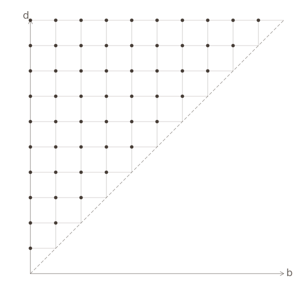
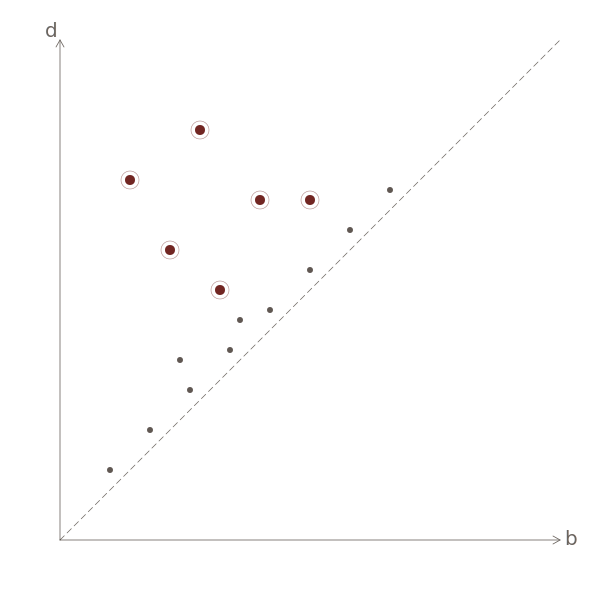

# The Plan of the Talk {.section-divider}

::: {.front-index data-title="Inside today's edition"}
| §    | Article                                                                    |
|:----:|:---------------------------------------------------------------------------|
|  I.  | Motivation — the certification gap in TDA-based classifiers.               |
|  II. | Construction — landmark grid, hat coordinates, closed-form weights.        |
| III. | Theory — stability, the classification certificate, sharpness.             |
|  IV. | Experiments — MUTAG, NCI1, ENZYMES; where the certificate fires.           |
|   V. | The wider arc — PALACE, CASTLE, open questions.                            |

:::

::: {.composing-rule .crosses}
:::

# § I.  Motivation {.section-divider}

::: {.section-deck}
*Or, from point clouds to certified classifiers — via topology.*
:::

::: {.plate}

:::

::: {.plate-caption}
*From a shape — a point cloud, a graph — to a persistence diagram. The descriptor is found; the question is **what space** to put it in.*
:::

## Classifying point clouds and graphs

::: {.standfirst}
Given a labeled corpus of [point clouds]{.term-with-icon data-icon="pointcloud"} or [graphs]{.term-with-icon data-icon="graph"}, learn a rule that predicts the label of a new instance.
:::

```{=html}
<svg width="0" height="0" style="position:absolute" aria-hidden="true">
  <defs>
    <symbol id="icon-pointcloud" viewBox="0 0 28 28">
      <g fill="currentColor" stroke="none">
        <circle cx="6"  cy="9"  r="1.6"/>
        <circle cx="11" cy="6"  r="1.6"/>
        <circle cx="16" cy="8"  r="1.6"/>
        <circle cx="9"  cy="13" r="1.6"/>
        <circle cx="14" cy="14" r="1.6"/>
        <circle cx="20" cy="11" r="1.6"/>
        <circle cx="11" cy="19" r="1.6"/>
        <circle cx="17" cy="20" r="1.6"/>
        <circle cx="22" cy="17" r="1.6"/>
      </g>
    </symbol>
    <symbol id="icon-graph" viewBox="0 0 28 28">
      <g stroke="currentColor" fill="currentColor" stroke-width="1.0">
        <line x1="6"  y1="7"  x2="14" y2="11" fill="none"/>
        <line x1="14" y1="11" x2="22" y2="8"  fill="none"/>
        <line x1="14" y1="11" x2="9"  y2="20" fill="none"/>
        <line x1="14" y1="11" x2="20" y2="21" fill="none"/>
        <line x1="9"  y1="20" x2="20" y2="21" fill="none"/>
        <line x1="22" y1="8"  x2="20" y2="21" fill="none"/>
        <circle cx="6"  cy="7"  r="2.4"/>
        <circle cx="14" cy="11" r="2.4"/>
        <circle cx="22" cy="8"  r="2.4"/>
        <circle cx="9"  cy="20" r="2.4"/>
        <circle cx="20" cy="21" r="2.4"/>
      </g>
    </symbol>
  </defs>
</svg>
```

::: {.dataset-cards}
::: {.dataset-card .fragment data-fragment-index="1"}


**ORBIT5K**

`‹5 000›` synthetic point clouds; five classes from orbit dynamics on the torus. *Canonical TDA point-cloud benchmark.*
:::

::: {.dataset-card .fragment data-fragment-index="2"}


**MUTAG**

`‹188›` molecular graphs; *mutagenic* vs. *non-mutagenic*. *Small, binary, clean.*
:::

::: {.dataset-card .fragment data-fragment-index="3"}


**NCI1**

`‹4 110›` chemical compounds; active vs. inactive in a cancer-cell-line screen. *Medium, binary, harder.*
:::
:::

::: {.composing-rule .fragment data-fragment-index="4"}
:::

::: {.transition-line .fragment .fade-up data-fragment-index="4"}
Every classical recipe begins the same way: turn each instance into a vector. The art is in *how*.
:::

## What does a good feature map need?

::: {.plate}

```{=html}
<svg xmlns="http://www.w3.org/2000/svg" viewBox="0 0 720 95">
<g>
<!-- horizontal dashed separator (aligned with stage arrows at y=48) -->
<line x1="64" y1="48" x2="126" y2="48" stroke="#c8b894" stroke-width="0.8" stroke-dasharray="2.5 2.5" opacity="0.75"/>
<!-- TL: point cloud class A (oxblood) -->
<g fill="#6c1d1a" stroke="none">
<circle cx="67" cy="30" r="2.2"/><circle cx="74" cy="25" r="2.2"/><circle cx="82" cy="29" r="2.2"/>
<circle cx="88" cy="35" r="2.2"/><circle cx="81" cy="40" r="2.2"/><circle cx="71" cy="40" r="2.2"/>
<circle cx="65" cy="36" r="2.2"/><circle cx="77" cy="33" r="2.2"/>
</g>
<!-- TR: point cloud class B (ink) -->
<g fill="#2b211a" stroke="none">
<circle cx="102" cy="30" r="2.2"/><circle cx="109" cy="25" r="2.2"/><circle cx="117" cy="29" r="2.2"/>
<circle cx="123" cy="35" r="2.2"/><circle cx="116" cy="40" r="2.2"/><circle cx="106" cy="40" r="2.2"/>
<circle cx="100" cy="36" r="2.2"/><circle cx="112" cy="33" r="2.2"/>
</g>
<!-- BL: graph class A (oxblood) -->
<g stroke="#6c1d1a" stroke-width="1.1" stroke-linecap="round" fill="none">
<line x1="67" y1="58" x2="83" y2="54"/>
<line x1="83" y1="54" x2="89" y2="67"/>
<line x1="67" y1="58" x2="75" y2="72"/>
<line x1="75" y1="72" x2="89" y2="67"/>
<line x1="83" y1="54" x2="75" y2="72"/>
</g>
<g fill="#f5efde" stroke="#6c1d1a" stroke-width="1.1">
<circle cx="67" cy="58" r="3.0"/><circle cx="83" cy="54" r="3.0"/>
<circle cx="89" cy="67" r="3.0"/><circle cx="75" cy="72" r="3.0"/>
</g>
<!-- BR: graph class B (ink) -->
<g stroke="#2b211a" stroke-width="1.1" stroke-linecap="round" fill="none">
<line x1="103" y1="58" x2="119" y2="54"/>
<line x1="119" y1="54" x2="125" y2="67"/>
<line x1="103" y1="58" x2="111" y2="72"/>
<line x1="111" y1="72" x2="125" y2="67"/>
<line x1="119" y1="54" x2="111" y2="72"/>
</g>
<g fill="#f5efde" stroke="#2b211a" stroke-width="1.1">
<circle cx="103" cy="58" r="3.0"/><circle cx="119" cy="54" r="3.0"/>
<circle cx="125" cy="67" r="3.0"/><circle cx="111" cy="72" r="3.0"/>
</g>
<text x="95" y="88" fill="#57473a" font-family="Alegreya SC, EB Garamond, Georgia, serif" font-size="10" letter-spacing="1.3" text-anchor="middle">LABELED SHAPES</text>
</g>
<g class="fragment" data-fragment-index="2">
<g stroke="#6c1d1a" fill="none" stroke-width="0.9">
<line x1="145" y1="48" x2="205" y2="48"/>
<path d="M 197 43 L 205 48 L 197 53"/>
</g>
<rect x="238" y="26" width="44" height="44" rx="2" fill="none" stroke="#2b211a" stroke-width="1.2"/>
<text x="260" y="56" fill="#2b211a" font-family="EB Garamond, Georgia, serif" font-size="24" text-anchor="middle">Φ</text>
<text x="260" y="88" fill="#57473a" font-family="Alegreya SC, EB Garamond, Georgia, serif" font-size="10" letter-spacing="1.3" text-anchor="middle">FEATURE MAP</text>
</g>
<g class="fragment" data-fragment-index="3">
<g stroke="#6c1d1a" fill="none" stroke-width="0.9">
<line x1="315" y1="48" x2="375" y2="48"/>
<path d="M 367 43 L 375 48 L 367 53"/>
</g>
<g stroke="#2b211a" fill="none" stroke-width="1.0">
<path d="M 435 28 L 428 28 L 428 68 L 435 68"/>
<path d="M 465 28 L 472 28 L 472 68 L 465 68"/>
</g>
<g fill="#2b211a" stroke="none" font-family="EB Garamond, Georgia, serif" font-size="11" text-anchor="middle">
<text x="450" y="42">v₁</text>
<text x="450" y="52">v₂</text>
<text x="450" y="62">⋮</text>
</g>
<text x="450" y="88" fill="#57473a" font-family="EB Garamond, Georgia, serif" font-style="italic" font-size="12" text-anchor="middle">ℝ<tspan baseline-shift="super" font-size="0.7em" dx="1">ℓ</tspan></text>
</g>
<g class="fragment" data-fragment-index="4">
<g stroke="#6c1d1a" fill="none" stroke-width="0.9">
<line x1="495" y1="48" x2="555" y2="48"/>
<path d="M 547 43 L 555 48 L 547 53"/>
</g>
<polygon points="587,24 643,24 643,34 587,62" fill="#6c1d1a" fill-opacity="0.10" stroke="none"/>
<polygon points="587,62 643,34 643,72 587,72" fill="#2b211a" fill-opacity="0.07" stroke="none"/>
<rect x="587" y="24" width="56" height="48" fill="none" stroke="#c8b894" stroke-width="0.6" stroke-dasharray="2 2"/>
<line x1="587" y1="62" x2="643" y2="34" stroke="#2b211a" stroke-width="1.0" stroke-dasharray="3 2"/>
<g fill="#6c1d1a" stroke="none">
<circle cx="598" cy="35" r="1.9"/>
<circle cx="604" cy="42" r="1.9"/>
<circle cx="609" cy="34" r="1.9"/>
<circle cx="602" cy="46" r="1.9"/>
<circle cx="608" cy="48" r="1.9"/>
</g>
<g fill="#2b211a" stroke="none">
<circle cx="619" cy="52" r="1.9"/>
<circle cx="626" cy="50" r="1.9"/>
<circle cx="632" cy="57" r="1.9"/>
<circle cx="622" cy="59" r="1.9"/>
<circle cx="629" cy="61" r="1.9"/>
</g>
<text x="615" y="80" fill="#57473a" font-family="Alegreya SC, EB Garamond, Georgia, serif" font-size="8" letter-spacing="0.6" text-anchor="middle">CLASSIFIER IN</text>
<text x="615" y="89" fill="#57473a" font-family="Alegreya SC, EB Garamond, Georgia, serif" font-size="8" letter-spacing="0.6" text-anchor="middle">HILBERT SPACE</text>
</g>
</svg>
```

:::

::: {.dispatches .fragment data-fragment-index="5" data-title="Notice to applicants" style="font-size: 0.82em; padding: 0.75rem 1.3rem 0.6rem; margin: 1.6rem auto 0.5rem;"}
::: {style="font-size: 0.94em; margin-bottom: 0.5em; line-height: 1.4;"}
For a [point cloud]{.term-with-icon data-icon="pointcloud"} or a [graph]{.term-with-icon data-icon="graph"}, three properties decide whether $\Phi$ is a feature map worth the name:
:::

- **Invariance.** $\Phi(X) = \Phi(g \cdot X)$ for every symmetry $g$ — relabeling of vertices in a graph; rotation / translation of a point cloud. Otherwise the corpus's labels are an accident of presentation.
- **Stability.** Small perturbations of $X$ produce small perturbations of $\Phi(X)$. Quantitative: $\|\Phi(X) - \Phi(X')\| \leq L \, d(X, X')$ for some intrinsic distance $d$.
- **Sample-efficient.** The map should be informative *without* needing $10^5$ examples to fit. Classical ML / GNNs over-fit in our regime.
:::

::: {.transition-line .fragment .fade-up}
Topology meets all three. The **bill** comes *later*. [To follow →]{.followup-stamp}
:::

## Topology as the descriptor

::: {.standfirst}
Persistence diagrams are the canonical multi-scale shape summary: invariant under isometry, stable under bottleneck distance, dimension-aware.
:::

For a point cloud $X \subset \mathbb{R}^d$, the Vietoris–Rips filtration $\{ \mathrm{VR}_r(X) \}_{r \geq 0}$ tracks the homology of $X$ at every scale; for a graph, the clique- or edge-weight filtration plays the same role. The resulting diagram $A = \{(b_i, d_i)\}$ in the birth–death plane is $1$-Lipschitz in the input — *the* descriptor for shape-aware classification.

::: {.dispatches data-title="So why don't we just plug it in?"}
- **The space.**  $(\mathcal{D}, d_\mathcal{B})$ is not Euclidean. Standard ML wants vectors.
- **The question.**  What kind of map $f \colon (\mathcal{D}, d_\mathcal{B}) \to \mathbb{R}^\ell$ is *good enough* for classification?
:::

The literature offers three families of answers. Each clears a different bar; one bar — we'll argue — is the right one and is still missing.

::: {.endmark}
:::

## Existing embeddings — and what they miss

::: {.standfirst}
Maps from $(\mathcal{D}, d_\mathcal{B})$ into Euclidean space are everywhere. They all bound distortion from one side; almost none bound it from both.
:::

::: {.dispatches data-title="Three families"}
- **Kernels.**  Persistence scale-space, sliced-Wasserstein, persistence-Fisher. Implicit map into an RKHS; Lipschitz in $d_\mathcal{B}$; no closed-form margin.
- **Vectorisations.**  Persistence images, persistence landscapes, Euler characteristic curves. Explicit; Lipschitz; hyper-parameters tuned on held-out data.
- **Neural-on-diagrams.**  PersLay, Set Transformer over PD. Strong empirically; opaque; bounds at best post-hoc.
:::

What all three share — and what we'll argue makes them *insufficient* — is an **upper bound on distortion**, with **no matching lower bound**. Two diagrams that are $\varepsilon$-apart in $d_\mathcal{B}$ can collide in feature space, and any classifier built on top is blind to that collision.

::: {.marginalia data-title="The analogy"}
- **Upper bound** ($\|f(x) - f(y)\| \leq \rho_+(d(x,y))$): close in $d_\mathcal{B}$ ⇒ close in features. *No false positives* — we don't see differences that aren't there.
- **Lower bound** ($\|f(x) - f(y)\| \geq \rho_-(d(x,y))$): far in $d_\mathcal{B}$ ⇒ far in features. *No false negatives* — we don't miss differences that are there.

Stability without discriminability is a kind, lying microscope.
:::

::: {.endmark}
:::

## Coarse embedding into Hilbert space

::: {.standfirst}
The functional-analytic notion of an *honest* embedding: bounded from both sides.
:::

::: {.marginalia data-title="Definition (coarse embedding)"}
A map $f \colon (X, d) \to H$ into a Hilbert space is a **coarse embedding** if there exist non-decreasing functions $\rho_-, \rho_+ \colon [0, \infty) \to [0, \infty]$ with $\rho_-(t) \to \infty$ as $t \to \infty$ such that
$$
\rho_-\bigl(d(x, y)\bigr) \;\leq\; \bigl\| f(x) - f(y) \bigr\|_H \;\leq\; \rho_+\bigl(d(x, y)\bigr)
\quad \text{for all } x, y \in X.
$$
:::

::: {.dispatches data-title="What each bound buys"}
- **$\rho_+$** — Lipschitz stability. Robustness to noise; no false positives of difference.
- **$\rho_-$** — discriminating power. No collapse of distinct classes; no false negatives of difference.
:::

This is the bar **Mitra–Virk (2021, 2024)** clear, *explicitly*, for $(\mathcal{D}^n, d_\mathcal{B})$ — with both control functions written down. PLACE is the classifier you get when you actually use that coarse embedding instead of just citing it.

> *Persistence has a shape; landmarks give it an address—that's **PLACE**.*

# § II.  Construction {.section-divider}

::: {.section-deck}
*The grid, the hat, the analytic weight rule.*
:::

::: {.plate}
{width="480"}
:::

::: {.plate-caption}
*The landmark grid $G_R$ on the birth–death plane — the scaffold that turns persistence into coordinates.*
:::

## The pipeline

::: {.plate data-plate="IV"}

:::

::: {.plate-caption}
**Pl. IV.**  *The PLACE pipeline.* `‹insert pipeline figure from Paper I — input · filtration · persistence · embedding · classify›`. Each stage's parameters are fixed analytically from training labels alone.
:::

## Landmark grid $G_R$

::: {.standfirst}
Place landmarks on a uniform lattice $G_R \subset \mathbb{R}^2_{\geq}$ in the birth-death plane. Each landmark $a$ owns a square $d_\mathcal{B}$-cover of side $3R$ (axis-aligned in the $\ell_\infty$ metric).
:::

::: {.dispatches data-title="Why a grid"}
- **Mitra–Virk (2024)** show $\mathrm{asdim}(\mathcal{D}^n,\, d_\mathcal{B}) \leq 2n$ — a finite-dimensional embedding exists.
- The grid makes that existence *concrete*: $\ell$ landmarks at $N$ geometric scales $R_1, \ldots, R_N$, no learned parameters.
- The cover-square geometry is what makes the weights closed-form.
:::

## Hat-function coordinates

For each landmark $a \in G_R$, define a compactly supported hat $\varphi_{R,p}\colon \mathbb{R}^2 \to \mathbb{R}_{\geq 0}$ that vanishes outside $a$'s cover square. The PLACE coordinate of a diagram $A$ is

$$
\Phi_p(A) \;=\; \sum_{a \in A} \boldsymbol{\varphi}_{R,p}(a) \;\in\; \mathbb{R}^{|G_R|}.
$$

::: {.dispatches data-title="Three properties, all closed-form"}
- **Permutation-invariant** in $A$ (it's a sum).
- **Lipschitz** in $d_\mathcal{B}$ — explicit constant from the hat width.
- **Cheap** — $O(|A| \cdot N)$ at inference; no neural net to forward through.
:::

## The closed-form weight rule

::: {.standfirst}
Across the $N$ scales, weight each scale's contribution analytically:
:::

$$
w_k^2 \;\propto\; \dfrac{d_{k+1}^2 - d_k^2}{R_k^2}.
$$

::: {.marginalia data-title="Lemma II.4 — sketch"}
The weights $w_k$ are the *unique maximizer* of the Mitra–Virk distortion slope $\lambda(\nu)$ over the $N$-scale family, subject to the $G_R$-cover constraint. Proof: differentiate $\lambda$ in $w$ and set to zero — the constraint is convex.
:::

This is the *whole* model selection step. There is no held-out validation, no Bayesian search, no random seeds.

# § III.  Theory {.section-divider}

::: {.section-deck}
*Three quantitative claims: stability, certificate, sharpness.*
:::

::: {.plate}
{width="480"}
:::

::: {.plate-caption}
*`‹ TODO: insert centroid-and-confidence-ball schematic from Paper I figure ›`*
:::

## Stability

::: {.marginalia data-title="Theorem III.1 (Stability)"}
For every pair of diagrams $A, A' \in \mathcal{D}^n$,
$$
\bigl\| \Phi(A) - \Phi(A') \bigr\|_2 \;\leq\; L \cdot d_\mathcal{B}(A, A'),
$$
with $L = L(N, R, p)$ explicit and computed in closed form from the grid parameters.
:::

::: {.standfirst}
*Intuition.* The hat is Lipschitz; summing Lipschitz functions over $|A|$ matched pairs preserves Lipschitzness, with the constant accumulating only logarithmically over the geometric scale ladder.
:::

::: {.endmark}
:::

## The certificate

::: {.marginalia data-title="Theorem III.2 (Classification certificate)"}
Let $\hat{\mu}_c$ be the empirical class centroid in $\Phi$-space and $r_m$ the margin radius (closed form from training labels). For a test diagram $A_\star$, if
$$
\bigl\| \Phi(A_\star) - \hat{\mu}_c \bigr\|_2 \;<\; r_m,
$$
then the linear classifier outputs class $c$ *and* the prediction is provably correct under the assumed noise model.
:::

::: {.standfirst}
The certificate is *per-input*: it fires on some test diagrams and stays silent on others. No global accuracy claim is made when it stays silent.
:::

## When the certificate fires

::: {.standfirst}
Sharpness is governed by a single inequality: $r_m < \Delta/2$, where $\Delta$ is the inter-class separation in $\Phi$-space.
:::

::: {.dispatches data-title="The firing condition, in plain English"}
- **$\Delta$ large** — classes are well-separated in PLACE coordinates → certificate fires often.
- **$r_m$ small** — class clusters are tight → certificate fires often.
- **Both fail** — certificate stays silent; classifier still predicts but without guarantee.
:::

The interesting question is *empirical*: on which datasets does the inequality hold for what fraction of test inputs? — § IV.

::: {.handnote}
note for the talk: emphasise that silent ≠ wrong.
:::

## Sample complexity

::: {.marginalia data-title="Theorem III.3 (Sample complexity)"}
With probability $\geq 1 - \delta$, the empirical centroids and $r_m$ converge to their population counterparts at rate
$$
n \;\geq\; O\bigl( L^2 \log(\ell/\delta) / \varepsilon^2 \bigr),
$$
where $L$ is the stability constant, $\ell = |G_R|$, and $\varepsilon$ is the desired margin slack.
:::

::: {.standfirst}
*Take-away.* The cost of having a certificate is $O(L^2 \log \ell)$ samples — modest, and entirely a function of grid choices.
:::

# § IV.  Experiments {.section-divider}

::: {.section-deck}
*Three datasets, one table, one honest qualifier.*
:::

::: {.plate}
{width="480"}
:::

::: {.plate-caption}
*A persistence diagram from MUTAG: $H_1$ features above the diagonal (oxblood), $H_0$ near it (ink).*
:::

## Headline results

::: {.stop-press}
MUTAG: certificate fires
:::

| Dataset    | Strongest baseline | + PLACE       | Δ          |
|------------|:------------------:|:-------------:|:----------:|
| MUTAG      |    `‹baseline›`    | **`‹place›`** | `‹+Δ›` pp  |
| NCI1       |    `‹baseline›`    |   `‹place›`   | `‹+Δ›` pp  |
| ENZYMES    |    `‹baseline›`    |   `‹place›`   | `‹+Δ›` pp  |

: **Tab. I.** — Mean accuracy (%) over `‹k›` seeds, fixed split.
The "Strongest baseline" is the best of {PI, PL, Euler, GNN-baseline} per row.

## When the certificate fires

::: {.standfirst}
The classification certificate is a *per-input* statement. The fraction of test inputs on which it fires is itself a property of the dataset.
:::

::: {.dispatches data-title="Certificate-firing rate"}
- **MUTAG.** `‹X›`% of test diagrams certified — the canonical "small + well-separated" win.
- **NCI1.** `‹Y›`% certified — sparser, but where it fires, it's right.
- **ENZYMES.** `‹Z›`% — the multi-class case; the certificate is silent on most of the ambiguous inputs.
:::

In every case the certified fraction has zero misclassifications.

## Where PLACE doesn't win

::: {.standfirst}
The talk would be incomplete without the negative cases. Two patterns worth naming.
:::

::: {.dispatches data-title="Honest qualifiers"}
- **Heterogeneous topology.** When the within-class variation in $H_*$ is large (e.g. `‹dataset›`), the centroid model under-fits and PLACE trails the GNN baseline by `‹δ›` pp.
- **Tiny diagrams.** When $|A|$ is small (degenerate filtrations), the sum $\Phi(A)$ has few non-zero coordinates and the certificate cannot fire.
:::

These limitations are *part of the value proposition*: PLACE knows when it doesn't know.

# § V.  The Wider Arc {.section-divider}

::: {.section-deck}
*Where PLACE sits in a longer programme.*
:::

::: {.plate}
{width="480"}
:::

::: {.plate-caption}
*`‹ TODO: insert PALACE → CASTLE roadmap schematic ›`*
:::

## PALACE & CASTLE

::: {.dispatches data-title="The arc beyond Paper I"}
- **PALACE** — the same construction with a *learned* filtration. Differentiable end-to-end; recovers PLACE in the limit of fixed-filtration training. Paper II, in submission.
- **CASTLE** — the inferential layer: two-sample tests and topological power calculations on top of $\Phi$. Closes the loop from "predict" to "decide". Forthcoming.
:::

The shared scaffold is the Mitra–Virk landmark embedding; the three modules build on it without contradicting each other.

## Open questions

::: {.dispatches data-title="What we'd like to pull next"}
- **Edge-weighted graphs.** Current PLACE uses unweighted Vietoris-Rips on graphs; how does the construction extend when edge weights matter?
- **Streaming PLACE.** Constant-memory variant for online-graph settings; the per-scale weights are already analytic, but the centroids need a sketch.
- **Beyond $H_0$ + $H_1$.** Paper I works in the lowest two dimensions; what changes when $H_2$ is informative (point clouds in $\mathbb{R}^4$ and above)?
:::

::: {.endmark .threefleur}
:::

## Thank you {.colophon}

```{=html}
<div class="finis">F  I  N  I  S</div>
<svg class="wax-seal" viewBox="0 0 80 80" role="img" aria-label="Author's seal">
  <defs>
    <style>
      .seal-ring  { stroke: currentColor; fill: none; stroke-width: 1.3; }
      .seal-inner { stroke: currentColor; fill: none; stroke-width: 0.45; }
      .seal-mark  { fill: currentColor; stroke: none; }
      .seal-thin  { stroke: currentColor; fill: none; stroke-width: 0.55; }
      .seal-mono  { font-family: 'Noto Serif Bengali', 'Bengali Sangam MN', 'Kalpurush', 'Vrinda', 'Lohit Bengali', serif; font-weight: 700; font-size: 12px; fill: currentColor; }
      .seal-band  { font-family: 'Alegreya SC', 'EB Garamond', Georgia, serif; font-size: 4.6px; letter-spacing: 0.22em; fill: currentColor; }
    </style>
    <path id="seal-top"    d="M 11 40 A 29 29 0 0 1 69 40" />
    <path id="seal-bottom" d="M 11 40 A 29 29 0 0 0 69 40" />
  </defs>
  <circle class="seal-ring"  cx="40" cy="40" r="36" />
  <circle class="seal-inner" cx="40" cy="40" r="33" />
  <circle class="seal-inner" cx="40" cy="40" r="22" />
  <text class="seal-band">
    <textPath href="#seal-top" startOffset="50%" text-anchor="middle">SVSHOVAN  MAJHI</textPath>
  </text>
  <text class="seal-band">
    <textPath href="#seal-bottom" startOffset="50%" text-anchor="middle">·  ANNO  MMXXVI  ·</textPath>
  </text>
  <g>
    <polygon class="seal-mark" opacity="0.16" points="35,33 40,24 40,41" />
    <polygon class="seal-mark" opacity="0.16" points="40,24 45,33 40,41" />
    <line class="seal-thin" x1="35" y1="33" x2="40" y2="24" />
    <line class="seal-thin" x1="40" y1="24" x2="45" y2="33" />
    <line class="seal-thin" x1="35" y1="33" x2="40" y2="41" />
    <line class="seal-thin" x1="45" y1="33" x2="40" y2="41" />
    <line class="seal-thin" x1="40" y1="24" x2="40" y2="41" />
    <line class="seal-thin" x1="35" y1="33" x2="45" y2="33" />
    <circle class="seal-mark" cx="35" cy="33" r="0.95" />
    <circle class="seal-mark" cx="40" cy="24" r="0.95" />
    <circle class="seal-mark" cx="45" cy="33" r="0.95" />
    <circle class="seal-mark" cx="40" cy="41" r="0.95" />
  </g>
  <text class="seal-mono" x="40" y="51" text-anchor="middle">সুশোভন</text>
  <g class="seal-mark">
    <circle cx="40" cy="56" r="0.6" />
    <circle cx="37" cy="59" r="0.6" />
    <circle cx="43" cy="59" r="0.6" />
  </g>
  <circle class="seal-mark" cx="9"  cy="40" r="0.95" />
  <circle class="seal-mark" cx="71" cy="40" r="0.95" />
  <g class="seal-mark">
    <circle cx="14" cy="14" r="0.55" />
    <circle cx="66" cy="14" r="0.55" />
    <circle cx="14" cy="66" r="0.55" />
    <circle cx="66" cy="66" r="0.55" />
  </g>
</svg>
```

::: {.contact}
[arXiv:2605.04046](https://arxiv.org/abs/2605.04046) · [smajhi.com](https://smajhi.com) · [s.majhi@gwu.edu](mailto:s.majhi@gwu.edu)
:::

::: {.subscription}
*With thanks to* Pramita Bagchi, Atish Mitra, Žiga Virk. ICERM TW-26-FCG · Brown University · 20 May 2026.
:::
